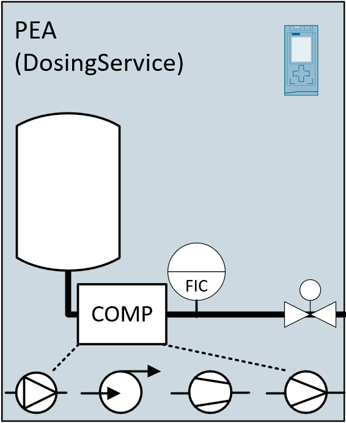
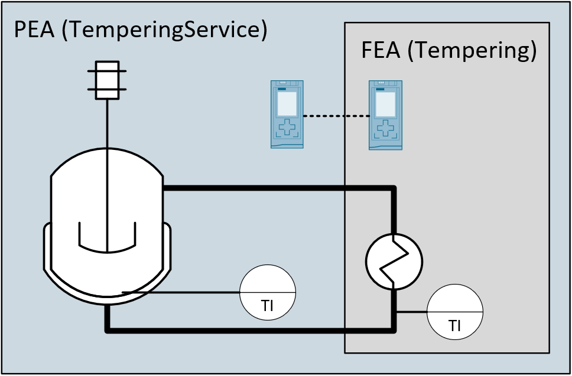
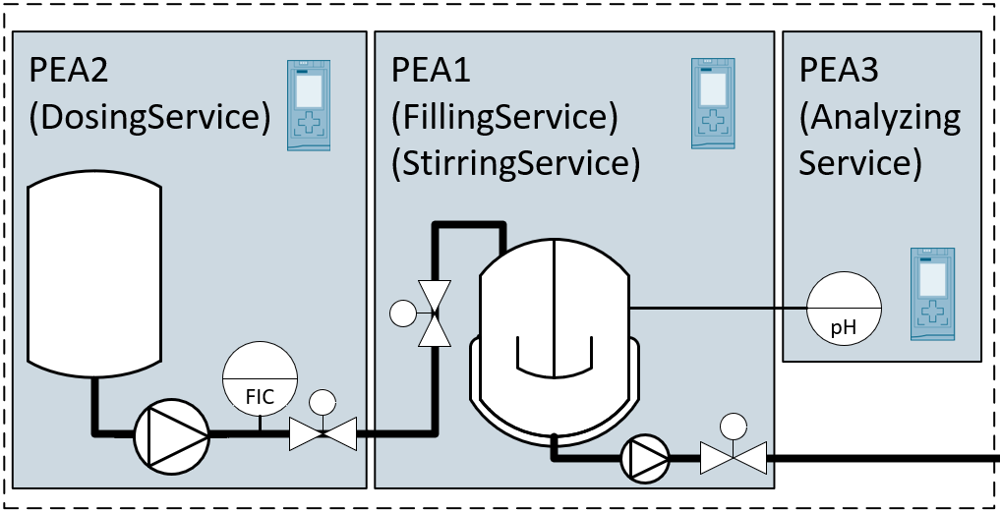
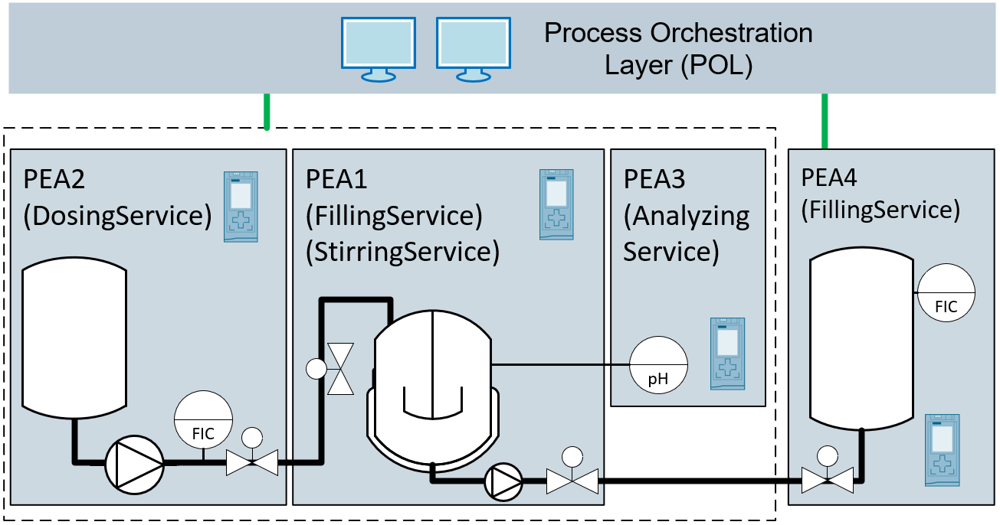

# :mortar_board: AUTOMATION SERVICE CHOREOGRAPHY

[:rewind:back](../README.md)

## :one: Motivation

### Einführung
Meine Motivation liegt in erster Linie darin pragmatische Lösungen für die Praxis mit wissenschaftlichen Methoden zu entwickeln. Das allein reicht jedoch noch nicht für eine Promotion. In den letzten 15 Jahren, in den ich bereits im Umfeld der Prozessleittechnik tätig bin, hat mir gezeigt, dass die Prozessindustrie einem zunehmenden Wandel unterliegt. Der Druck auf die Firmen in der Prozessindustrie, effizienter und schneller in der Entwicklung und der Produktion neuer Produkte zu werden, steigt kontinuierlich an [1]. Diese Entwicklung des Marktes gefährdet langfristig die Profitabilität der produzierenden Industrie. 

### Chronologie

Um frühzeitig diesem Trend entgegenzuwirken wurde bereits 2009 mittels des F3 Factory Project ein erstes eu-gefördertes Projekt gestartet, in dem es um die Entwicklung effizienterer Prozesse in der chemischen Industrie ging. F3 ist ein Akronym für "Flexible, Fast and Future Factory". Fokus diese Projekts war die Untersuchung und Entwicklung einer neuen Produktionstechnologie nach einem modularen Plug and Play Ansatz [2]. Die darin erlangten Kenntnisse hinsichtlich der Automatisierung einer solchen Plug and Play fähigen Produktionsanlage mündeten letztlich in einer Namur-Empfehlung NE148, die im Jahr 2013 veröffentlicht wurde [3]. Bereits im Jahr 2014 wurde von einem Konsortium bestehend aus der Fa. Wago und den beiden Universitäten TU Dresden und Helmut-Schmidt-Universität Hamburg ein erster Ansatz zur Umsetzung eines solchen Plug and Play Mechanismus für industrielle Prozessanlagen vorgestellt [4]. Nach einer erfolgreichen Präsentation des Konzepts auf der 77. Namur-Hauptsitzung 2014 wurden das Konzept in die gemeinsamen Hände von NAMUR und ZVEI übergeben. Unter dem gemeinsamen Dach beider Organisationen wurde eine Gremien-Landschaft geschaffen, die seit vielen Jahren in Zusammenarbeit mit dem VDI/VDE-GMA Fachausschuss 5.16 (Zukünftige Architekturen der Automatisierung) die Richtlinien-Reihe VDI/VDE/NAMUR 2658 [5] entwickeln. Die Community der modularen Produktion ist in den letzten Jahren stetig gewachsen [6]. Die Richtlinienreihe definiert Laufzeit-Schnittstellen und semantische Modelle für die Umsetzung Plug and Play fähiger Produktionsmodule für die modulare Prozessindustrie.

Der Ursprung meiner Forschungsarbeit entstammt den Arbeiten und der Beteiligung an dieser Community der modularen Produktion im Kontext der Richtlinien-Reihe [5]. Im nächsten Abschnitt gibt es eine kurze Darstellung dieser und einer zweiten Richtlinie im Umfeld modularer Prozessanlagen sowie die daraus abgeleitete Motivation. 

### Standardisierung

Für die Standardisierung im Umfeld der modularen Produktion lässt sich derzeit auf zwei Richtlinien-Reihen verweisen - mit der Richtlinie VDI 2776 [7] spezifiziert den verfahrenstechnischen Teil einer modularen Produktionsanlage, mit der Richtlinie VDI/VDE/NAMUR 2658 werden die automatisierungstechnischen Grundlagen Hersteller-neutral definiert. An dieser Stelle wird auch die VDI 5201 genannt [8]. Diese Richtlinie führt die beiden Begrifflichkeiten Flexibilität und Wandlungsfähigkeit ein. Beide Begriffe sind für meine weitere Arbeit relevant.

Die Richtlinien-Reihe VDI/VDE/NAMUR 2658 [5] spezifiziert im Teil 4 ein generisches Service-Konzept basierend auf jeweils einer zustands-basierten und kontinuierlichen Schnittstelle. Über die zustands-basierte Schnittstelle [9] erfolgt die prozedurale Koordination aus dem übergeordneten System. Die kontinuierliche Schnittstelle bilden die beiden Bausteine der Process Value Outputs und der Process Value Inputs. Beide Teile existieren für binäre (BOOL), ganzzahlige (DINT) und gebrochene Zahlen (REAL) sowie Zeichenketten (STRING) Das übergeordnete System, genannt Process Orchestration Layer, hat als übergreifendes zentrales System die Aufgabe sowohl die prozedurale Koordination als auch den Datenaustausch für die kontinuierliche Prozesswertverschaltung umzusetzen.

Die Richtlinien-Reihe VDI 2776 [7] spezifiziert eine Art physikalisches Modell einer modularen Anlage, analog zur IEC 61512 [10]. Hierbei werden folgende vier Ebenen von oben nach unten spezifiziert - Modular Plant (MP), Process Equipment Assembly (PEA), Functional Equipment Assembly (FEA), Component (COMP). Die Flexibilität aber insbesondere die Wandlungsfähigkeit einer modularen Produktionsanlage hängt primär nun davon ab, welche Möglichkeiten es gibt, aus den drei unterlagerten Ebenen des Modells die konkrete Anlage zu formen. 

Im nächsten Abschnitt werden hinsichtlich der Wandlungsfähigkeit modularer Anlagen vier praktische Anwendungsfälle beschrieben. Ziel dieser Anwendungsfälle ist den Aspekt der Wandlungsfähigkeit einer modularen Anlage greifbarer machen. 

### Wandlungsfähigkeit in modularen Anlagen

Use Case 1 | Wandlungsfähigkeit durch Komponententausch
--- | ---
 | Die Komponenten-Ebene stellt die unterste Modellebene dar und ist unterhalb der modularen Funktionseinheit (FEA). Durch die Einführung einer Integrationsebene für Komponenten wird die Möglichkeit geboten, einzelne Ventile, Pumpen oder Sensoren auszutauschen. Insbesondere im Labor- und Technikumsumfeld, ist es notwendig, je nach Material- und Produkteinschränkungen, Sensoren oder Aktoren auszutauschen. Die Funktion der Komponenten wird dadurch nicht geändert, im Falle einer Pumpe, kann somit ein unterschiedlicher Fördermechanismus eingesetzt werden.

Use Case 2 | Wandlungsfähigkeit durch Tausch einer funktionalen Einheit
--- | ---
 | Dieser Anwendungsfall fokussiert einen möglichen Austausch oder eine anwendungs- spezifische Erweiterung von Funktionen innerhalb einer modularen Prozesseinheit. Ein typischer Anwendungsfall für eine Erweiterung ist die Integration von Heiz- und Kühlaggregaten in Behälter, die sowohl als unbeheizter Vorlage- als auch als beheizter Reaktionsbehälter genutzt werden können.

Use Case 3 | Wandlungsfähigkeit durch Kombination mehrerer modularer Prozesseinheiten
--- | ---
 | Der Anwendungsfall der Kombination modularer Prozesseinheiten ist äuserst vielseitig. Zum einen sind eine Vielzahl von prozesstechnischen Anwendungen heute nicht derart modularisierbar, dass keine offenen Regelkreise oder Verriegelungen entstehen. Aus diesem Grund ist es notwwendig, die Möglichkeit zu bieten, Funktionen von modularen Prozesseinheiten derart zusammenzuführen, dass diese eine neue zusammengesetzte Funktion ergeben. Ein zweiter exemplarischer Fall ist das sogenannte Numbering-Up. Hierbei wird eine identische Funktion in Form einer zweiten modularen Prozesseinheit parallel angeordnet, um somit den Durchsatz bzw. die Kapazität zu verdoppeln. Beide Automation Services, sind zu einem zusammenzuführen. Diese zusammengesetzten Funktionen sind wiederum als neuer Automation Service bereitgestellt und nutzbar.

Use Case 4 | Wandlungsfähigkeit in Anlagen durch modulare Prozesseinheiten
--- | ---
 | Zur Realisierung einer modularen Anlage, sind die durch die einzelnen PEAs bereitgestellten Automation Services in der Art zusammenzuführen, dass diese eine Produktion umsetzt. Hierzu sind die Automation Services koordiniert auszuführen und zu überwachen. Diese Ebene fokussiert auf das Zusammenführen aller für die Produktion notwendigen Automation Services.

## :hash: References

No. | Publication
--- | ---
1 | Small-Scale Flexible Plants - Towards a More Agile and Competitive EU Chemical Industry; v. Kranenburg, Sofra, Verdoes, de Graaff; 2015; [Link](https://repository.tudelft.nl/view/tno/uuid%3A492dadff-af9d-4059-a41e-2b77270197b2)
2 | Chemieanlage der Zukunft: das F3 Factory-Project; Liebl; 2010; [Link](https://www.chemietechnik.de/anlagenbau/chemieanlage-der-zukunft-das-f3-factory-projekt.html)
3 | Namur Recommendation NE148 - Automation Requirements relating to Modularisation of Process Plants; NAMUR; 2013; [Link](https://www.namur.net/de/empfehlungen-und-arbeitsblaetter/aktuelle-nena.html?no_cache=1&tx_nena_pi1%5Bda%5D=377&cHash=9de1d4ebf7033ec8090a9a28b26334c1)
4 | Referenz - Mit DIMA zur Smarten Produktion; WAGO; 2020; [Link](https://www.wago.com/de/digitalisierung/wandlungsfaehigkeit/dima)
5 | Richlinien-Reihe VDI/VDE/NAMUR 2658 - Automation engineering of modular systems in the process industry; Beuth Verlag; [Link](www.vdi.de/2658)
6 | Sonderschau Modulare Produktion auf der HMO 2019 - Modularisierung erhöht Flexibilität von Prozessanlagen erheblich; ZVEI; 2019; [Link](https://www.zvei.org/presse-medien/pressebereich/sonderschau-modulare-produktion-auf-der-hannover-messe-2019-modularisierung-erhoeht-flexibilitaet-von-prozessanlagen-erheblich/)
7 | Richtlinien-Reihe VDI 2776 - Process engineering plants - Modular plants; Beuth Verlag; [Link](www.vdi.de/2776)
8 | Richtlinie VDI 5201 - Adaptability - Description and measurement of the adaptability of manufacturing companies: Beuth Verlag; [Link](www.vdi.de/5201)
9 | Bloch H.., Hensel S., Hoernicke M., Katharina S., Menschner A., Fay A., Urbas L., Knohl T., Bernhausen J., (2018), State-based control of process services within modular process plants, 51st CIRP Conference on Manufacturing Systems, 1088-1093, [Link]()
10 | IEC 61512 //TODO