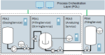

# :mortar_board: AUTOMATION SERVICE CHOREOGRAPHY

[:rewind:back](../README.md)

Editing Status: :heavy_check_mark: (discussed)

Last Modification: 23.07.2021

---

## :one: Use Cases of Adaptability

Adaptability refers to structural changes of the production system. Structural changes are preceded by changings of the system in terms of design and automation. From a design point of view, a modular production
system can be separated into four different physical levels:

- Components (COMP)
- Functional Equipment Assemblies (FEA)
- Process Equipment Assemblies (PEA)
- Modular Plant (MP)

Those levels are derived from  [1].

Four use cases were defined (see Use Case 1 — Use Case 4) which are exemplary but representative for the physical and automation-related aspects of adaptability.

Use Case 1 | Adaptability Case of Components in PEAs and FEAs
--- | ---
 |  This use case represents an adaptability case for components within a modularized process equipment assembly or functional equipment assembly. Actuators or sensors can be exchanged to be adaptable to any process requirements and process conditions.
Example | Change of Sensors with different measurement types to be adaptable to the best fitting devices.

Use Case 2 | Adaptability Case of FEAs in PEAs and or other FEAs
--- | ---
 |  This use case represents an adaptability case for functional equipment assemblies which can be changed to be adaptable to process requirements or to be able to add and remove functionality as required.
Example | Add or Remove a temperature package unit (as FEA) if its required or not.

Use Case 3 | Association Case for higher process functionality by combining PEA and FEA services
--- | ---
 |  This use case represents an association case to be able to combine existing functionalities of fine-granular process equipment or functional equipment assemblies, to be able to build up higher process functionality based on existing automation services. The associated services can further be used within the last use case, the modular plant.
Example | Associate a dosing service, a filling service and a stirring service to an associated neutralization service. Each service can be realized in an own PEA or FEA.

Use Case 4 | Association Case for production process by combining PEAs to a modular plant
--- | ---
 |  This use case represents an association case to be able to build up the modular production systems based on functionalities of process equipment assemblies or associated automation services (as in use case 3).
Example | Build up a modular plant for pharma useable water with a neutralization and disinfection function based on modular equipment.

## :two: Detailed Example of my ETFA2021 Publication

*This section is complementary to the paper 'Software Patterns for the Realization of Automation Service Choreographies' at IEEE Conference of Emerging Technologies and Factory Automation ETFA 2021*

### :blue_square: Process Technology Function
The presented setup of PEAs in Figure 1 shows a PEA-spanning associated Automation Service realizing a neutralization function. The process function is used to set and control the pH value of the liquid within the reactor tank. 

Depending on the initial situation one liquid is dosed from the storage tank of PEA2 into the reactor of PEA1. If the liquid in the reactor is an alkaline material an acidic liquid is dosed. If the liquid in the reactor is an acidic one, an alkaline liquid is dosed. 

In dependence of the pH value, the liquid flow from the storage tank into the reactor is controled by the dosing unit. For that, the analyzing service in PEA3 measures the pH value and controls the flow from the tank (PEA2) into the reactor (PEA1). 

  |
--- |
*Figure 1 - PEA-spanning reference example of a neutralization service consisting of three PEAs   and its four services* |

### :blue_square: Automation Services Profiles

**PEA 1 - Stirring Service**  
This service represents a phase service to stir the liquid inside the reactor. A agitator with a stirring drive is controlled via his frequency converter which is controlled and monitored by the integrated service logic. 

Class | Component
--- | ---
Procedure | Stirring (1, NSC)
Procedure Parameter | Speed (REAL)

**PEA 1 - Filling Service**  
This service represents a control module service to open the inlet pipeline to the reactor of the PEA. For operational safety reasons, the standard demands that each PEA protects itself. This service logic just open the inlet valve when its executed, otherwise the valve is closed.

Class | Component
--- | ---
Procedure | Activate (1, NSC)
Process Value Output | ValveOpen (BOOL)  MaxLevel (BOOL)

**PEA 2 - Dosing Service**  
This service represents an equipment module service that encapsulates the flow-control of the stored liquid of its storage tank. The outlet pipeline is closed with a binary valve. The integrated flow control loop is realized by a flow indicator, a PID controller which controls a flow pump. As protection regarding dry-pumping a level indication is also included (not shown in figure 1).

Class | Component
--- | ---
Procedure | Dosing with external Setpoint (5, NSC)
Configuration Parameter | PID-MODE (DINT) P-Part (REAL) I-Part (REAL) D-Part (REAL)
Process Value Inputs | FlowSP (REAL)  PumpLock (BOOL)
Report Values | FlowSP (REAL) FlowPV (REAL)

**PEA 3 - Analyzing Service**  
This service represents a control module service that encapsulates the pH value measurement functionality. In addition, the service also provides an integrated PID controller to transform the measured pH value into a flow setpoint for a dosing service.

Class | Component
--- | ---
Procedure | Neutralization (2, SC)
Procedure Parameter | pHSetpoint (REAL)
Configuration Parameter | PID-MODE (DINT) P-Part (REAL) I-Part (REAL) D-Part (REAL)
Process Value Outputs | pHValue (REAL) FlowSP (REAL)
Report Values | phValue (REAL) FlowSP (REAL)

### :blue_square: Associated Automation Service Functionality

An automation functionality, in my investigations, is differentiated into three level of automation logic - procedural, regulatory and interlocking logic parts. 

**Interlocking Logic Parts**  
Interlocking relationships are required for operational safety. The process value outputs of the Filling Service (PEA1) contain the position of the inlet valve as well as the limit switch of the tank, that is used as OR-processed input at the dosing service (PEA2). This input represents the interlock signal of the pump control. If the valve is closed for any reason or the limit switch is tripped, the pump is stopped immediately via its interlock mechanism. This mechanism bases on continuous value processing.

Information Source (Observed Service)  | Information Sink (Observing Service)
--- | ---
PEA1.Filling.ValveOpen OR NOT PEA1.Filling.MaxLevel | PEA2.Dosing.PumpLock

*Table 1 - Choreography relation rule for the interlocking logic part*

**Regulatory Logic Parts**  
Continuous value processing is also used for the regulatory relations. By starting the analyzing service (PEA3), the pH value is measured continuously and processed by a pH controller. The controller calculates the flow setpoint that is read by the dosing service (PEA2). The external flow setpoint is used to regulate the flow from PEA2 to the PEA1. The output of the pH controller is specified in ml/min. The dosing service requires the setpoint in l/min. Due to these different units, the value must be converted between the pH controller and the flow controller. 

Information Source (Observed Service)  | Information Sink (Observing Service)
--- | ---
PEA3.Analyzing.FlowSP * [1000] | PEA2.Dosing.FlowSP

*Table 2 - Choreography relation rule for the regulatory logic part*

**Procedural Logic Parts**  
Procedural relations are defined on the basis of if-then rules. If the analyzing service (PEA3) is starting, then the filling service (PEA1) starts. With the filling service the stirring service (PEA1) and the dosing service (PEA2) will start. For this, the filling service (PEA1) reads the current state of the analyzing service (PEA3) and the dosing service (PEA2) and the stirring serice (PEA1) read the state from the filling service. By defining multiple if-then rules between the services of the PEAs, a defined order of procedural actions as well as defined reactions in case of exceptions are created.

Information Source (Observed Service)  | Information Sink (Observing Service)
--- | ---
**Relation Group PEA3-PEA1** |
PEA3.Analyzing.StateCur ? Starting  | PEA1.Filling.CommandInt = Start
PEA3.Analyzing.StateCur ? Completing  | PEA1.Filling.CommandInt = Complete
PEA3.Analyzing.StateCur ? Resetting  | PEA1.Filling.CommandInt = Reset
PEA3.Analyzing.StateCur ? Pausing  | PEA1.Filling.CommandInt = Pause
PEA3.Analyzing.StateCur ? Resuming  | PEA1.Filling.CommandInt = Resume
PEA3.Analyzing.StateCur ? Holding  | PEA1.Filling.CommandInt = Hold
PEA3.Analyzing.StateCur ? Unholding  | PEA1.Filling.CommandInt = Unhold
PEA3.Analyzing.StateCur ? Stopping  | PEA1.Filling.CommandInt = Stop
PEA3.Analyzing.StateCur ? Aborting  | PEA1.Filling.CommandInt = Abort
**Relation Group PEA1-PEA1** |
PEA1.Filling.StateCur ? Starting  | PEA1.Stirring.CommandInt = Start
PEA1.Filling.StateCur ? Completing  | PEA1.Stirring.CommandInt = Complete
PEA1.Filling.StateCur ? Resetting  | PEA1.Stirring.CommandInt = Reset
PEA1.Filling.StateCur ? Stopping  | PEA1.Stirring.CommandInt = Stop
PEA1.Filling.StateCur ? Aborting  | PEA1.Stirring.CommandInt = Abort
**Relation Group PEA1-PEA2** |
PEA1.Filling.StateCur ? Starting  | PEA2.Dosing.CommandInt = Start
PEA1.Filling.StateCur ? Completing | PEA2.Dosing.CommandInt = Complete
PEA1.Filling.StateCur ? Resetting  | PEA2.Dosing.CommandInt = Reset
PEA1.Filling.StateCur ? Pausing  | PEA2.Dosing.CommandInt = Pause
PEA1.Filling.StateCur ? Resuming  | PEA2.Dosing.CommandInt = Resume
PEA1.Filling.StateCur ? Holding  | PEA2.Dosing.CommandInt = Hold
PEA1.Filling.StateCur ? Unholding  | PEA2.Dosing.CommandInt = Unhold
PEA1.Filling.StateCur ? Stopping  | PEA2.Dosing.CommandInt = Stop
PEA1.Filling.StateCur ? Aborting  | PEA2.Dosing.CommandInt = Abort

*Table 3 - Choreography relation rule for the procedural logic part*

*Description of the short notation of observed and observig entities* | 
--- | 
\<PEA>.\<Service>.\<Information>  |
PEA: Name / Identifier of the PEA |
Service: Name / Identifier of the Service |
Information: Name / Identifier of the observed Information |

### :blue_square: The Automation Service Choreography

The automation service choreography of an associated automation service consisting of multiple services out of one or also multiple PEAs is characterized by the sum of rules of the interlocking, regulatory and procedural logic. 

The choreography specification of the given ETFA example are given in the three tables 1-3 in the previous section.

## :hash: References

No. | Publication
--- | ---
1 | VDI-GVC 2776