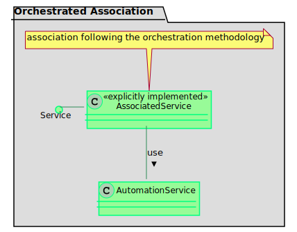
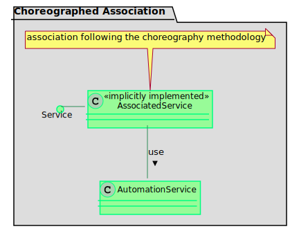

# :mortar_board: AUTOMATION SERVICE CHOREOGRAPHY

[:rewind:back](../README.md)

## :two: Basics about Service-Oriented Automation Systems

### Introduction of Service-Oriented Automation Systems
Service-oriented architecture is a type of architectural pattern in which multiple services can be combined to form new associated services. Each of the services communicates with each other via message-based telegrams. The idea is to ensure interoperability between different service implementations from different vendors. The paradigm of service-oriented architectures already know several derivates. The most known are the origin service-oriented architecture (SOA) and the micro-service architecture (MSA) [1].

One of the leading contribution in the domain of service-oriented automation can be named back to Mr. Jammes and Mr. Smit in 2005 [2]. Its a contribution that can be attributed to a project which is named SIRENA [3]. SIRENA is an acronym and stands for "Service Infrastructure for Real-Time Embedded Networked Applications. It was focused on the service based interconnection of industrial devices. As technology foundation web service technologies specialized for devices were used - Device Profile for Web Services (DPWS). SIRENA was only one of three projects that build on each other. With SOCRADES [4] and IMC-AESOP [5] the research in web-service based automation systems were driven over all levels of automation from field up to the enterprise level. All of these projects have in common, the used web service technologies and the applied service-oriented architecture pattern.

In the past 5-6 years, service-oriented automation systems are coming back into the focus, following the OPC UA technology. With DEVEKOS [7] in the factory industry ENPRO2-ORCA [6] in the process industry two known projects working on service-based concepts using OPC UA mechanisms. In the both contribution [7] and [8] both architecture patterns were analyzed in the context of service-oriented automation systems. The authors pointed out, that the considered automation systems in the domain of [6] are comparable to micro-service architectures. The so-called Module Type Package concept specifies several aspects of an automated system in a vendor independent manner. The resulting architecture approach of several automation systems providing a dedicated service functionality fulfills criteria of the micro-service architecture pattern.

### Service-oriented Automation in Process Industry

In both architecture types, SOA and MSA, the idea of combining existing services into new functionality is the same. The literature recognizes two types of association mechanisms - orchestration and choreography. While orchestration is the preferred association mechanism in approaches based on classical SOA architecture, the use of choreography is preferred in MSA architectures [1].

In the process industry, a so-called VDI standard (VDI/VDE/NAMUR 2658 [8]) is currently being developed which, among other things, specifies interfaces for a service-based automation system. In [9, 10] the authors analyzed the characteristics of SOA and MSA compared to the specification of the standard. The result of this analyze is that the VDI standard is following the principles of a micro-service architecture. 

### Terms and Definitions regarding service-oriented Automation
The derivation of the terms and definitions are presented in these papers [11, 12, 13]

**AutomationService**  
An automation service provides an automated functionality via standardized interfaces in a defined behavior.

**Independence Criterion**  
The characteristic of a full realization of the input-process-output pattern within a service entity is defined as the independence criterion. It is a property that points out the ability to achieve a real-world effect from an automation perspective.

**Service Association**  
A service association is used to combine multiple service entities to create a new service entity, which fulfills the independence criterion.

**Elementary Automation Service**(*1)  
An elementary service represents a non-associated service, which provides minimum one dedicated parameterizable procedure and fulfills the independence criterion on its own.

**Sub-elementary Automation Service**(*1)  
A sub-elementary service represents a non-associated service, which provides minimum one dedicated parameterizable procedure, but does not fulfill the independence criterion, and contains only parts of the input-process-output pattern.

***1 Supplement**  
An supplement to the definition in [11, 12, 13] also describes the possibility of combining elementary and sub-elementary properties for Automation Services. So-called procedures, as defined in [2658-4], can represent elementary or sub-elementary functions. Both types of functions can be implemented as procedures in an Automation Service. In that case, the term automation service with elementary procedures and sub-elementare procedures are used.

### Association Mechanism - Orchestration

 
Graphical Representation
 | Theoretical Definition
--- | ---
 | An orchestration is present if n+1 services are necessary for the realization of a service association that can be defined as independent. The additional (+1) service is the only responsible for the execution of the subordinate and hidden (n) associated, elementary and/or sub-elementary services.
Communication Pattern | The communication pattern of an orchestration follows a star-like structure.
Interaction | For the orchestration of services, a request-reply interaction is required.
Accessability | Orchestration defines an executable functionality from the perspective and under the control of a single accessible orchestrating entity.
Deployment | Orchestration can be realized in a centralized manner by placing the orchestrating entity in the overlaying control system as well as in a decentralized manner, by implement the orchestrating entity in a module-integrated controller.
Hierarchy | An orchestration entity can be made accessible as a new independent service, except on the highest level of orchestration.
Complexity | Reduction of complexity in engineering and runtime is realized by hiding the underlying services behind the orchestrating service.

The characteristics of orchestration are determined in [11].

### Association Mechanism - Choreography

 
Graphical Representation
 | Theoretical Definition
--- | ---
 | A Choreography is present when n services, based on the knowledge of their own role share the responsibility for the realization of a service association, which can be defined as independent, transparently among themselves to the same extent.
Communication Pattern | The communication pattern of an choreography follows a peer-to-peer structure.
Interaction | A choreographed service interacts via send-receive or monitor-act interactions.
Accessability | A choreography describes the observable behavior determined by the interaction of services accessible via a single or two different endpoints.
Deployment | A choreography can be executed centrally within a uniform runtime environment as well as distributed over several potentially heterogeneous runtime environments.
Hierarchy | Choreographies result in a transparent, non-hierarchical functional association.
Complexity | Choreographies realize a transparent association, whereby the complexity of interaction rules increases with the number of relevant services and interactions.

The characteristics of choreography are determined in [11].

## :hash: References

# | Publication
--- | ---
1 | Richards M., (2015), Microservices vs. Service-Oriented Architecture, O’Reilly Media, Sebastopol
2 | Jammes F., Smit H., (2005), Service-oriented Paradigms in Industrial Automation, Transactions on Industrial Informatics, 62-70, IEEE
3 | SIRENA Project Website, (2005), 13.10.2019; [Website](https://itea3.org/project/sirena.html)
4 | SOCRADES Project Website, (2009), 13.10.2019; [Website](http://www.socrades.net/)
5 | IMC AESOP Project Website, (2013), 13.10.2019; [Website](https://cordis.europa.eu/project/rcn/95545/factsheet/en)
6 | ORCA Project Website, (2019), 13.10.2019; [Website](http://enpro-initiative.de/ENPRO+2_0/ORCA-p-275.html)
7 | DEVEKOS Project Website, (2017), 13.10.2019; [Website](https://www.devekos.org/projekt/neue-maschinenarchitektur/)
8 | VDI/VDE/NAMUR 2658 [Website](www.vdi.de/2658)
9 | Bloch H., Fay A., Knohl T., Hoernicke M., Bernshausen J., Hensel S., Hahn A., Urbas L.,  Analysis of service-oriented architecture approaches suitable for modular process automation, (2016), 21st International Conference on Emerging Technologies and Factory Automation (ETFA), IEEE, Berlin; [Link](https://www.researchgate.net/publication/309584029_Analysis_of_service-oriented_architecture_approaches_suitable_for_modular_process_automation)
10 | Bloch H., Fay A., Hoernicke M., A microservice-based architecture approach for the automation of modular process plants, (2017) 22nd IEEE International Conference on Emerging Technologies and Factory Automation (ETFA); [Link](https://www.researchgate.net/publication/319701797_A_Microservice-Based_Architecture_Approach_for_the_Automation_of_Modular_Process_Plants)
11 | Stutz A., Fay A., Barth M., Maurmaier M., (2020), Orchestration vs. Choreography – Functional Association for Future Automation Systems, IFAC World Congress 2020, Berlin [Link](https://www.researchgate.net/publication/343684953_Orchestration_vs_Choreography_-_Functional_Association_for_Future_Automation_Systems)
12 | Stutz A., Fay A., Barth M., Maurmaier M., (2020), Choreographies in Microservice-Based Automation Architectures – Next Level of Flexibility for Industrial Cyber-Physical Systems, 3rd International Conference on Industrial Cyber-Physical Systems, IEEE, Tampere, Finnland; [Link](https://www.researchgate.net/publication/343684954_Choreographies_in_Microservice-Based_Automation_Architectures_-_Next_Level_of_Flexibility_for_Industrial_Cyber-Physical_Systems)
13 | Stutz A., Maurmaier M.,Spaethe F., Hill P.; (2020);Introduction, Development and Application of sub- elementary Services for modular Plants [Link](https://www.researchgate.net/publication/343684952_Introduction_Development_and_Application_of_sub-_elementary_Services_for_modular_Plants)