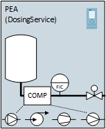
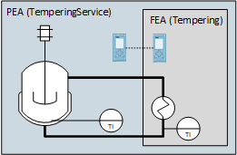
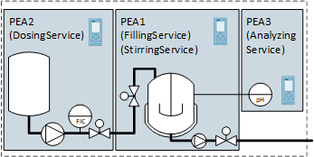
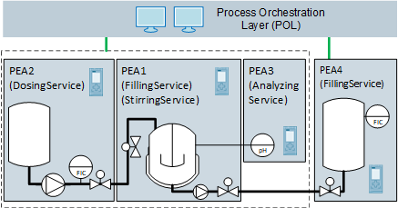

# :mortar_board: AUTOMATION SERVICE CHOREOGRAPHY

[:rewind:back](../README.md)

Editing Status: :construction: (under construction))

Last Modification: 09.05.2021

---

## :three: Reference Use Cases for Adaptability

Adaptability refers to structural changes of the production system. Structural changes are preceded by changings of the system in terms of design and automation. From a design point of view, a modular production
system can be separated into four different physical levels:

- Components (COMP)
- Functional Equipment Assemblies (FEA)
- Process Equipment Assemblies (PEA)
- Modular Plant (MP)

Those levels are derived from  [1].

Four use cases were defined (see Use Case 1 — Use Case 4) which are exemplary but representative for the physical and automation-related aspects of adaptability. 

Use Case 1 | Adaptability Case of Components in PEAs and FEAs
--- | ---
 |  This use case represents an adaptability case for components within a modularized process equipment assembly or functional equipment assembly. Actuators or sensors can be exchanged to be adaptable to any process requirements and process conditions.
Example 1 | Change of Sensors with different measurement types to be adaptable to the best fitting devices.

Use Case 2 | Adaptability Case of FEAs in PEAs and or other FEAs
--- | ---
 |  This use case represents an adaptability case for functional equipment assemblies which can be changed to be adaptable to process requirements or to be able to add and remove functionality as required.
Example 1 | Add or Remove a temperature package unit (as FEA) if its required or not.

Use Case 3 | Association Case for higher process functionality by combining PEA and FEA services
--- | ---
 |  This use case represents an association case to be able to combine existing functionalities of fine-granular process equipment or functional equipment assemblies, to be able to build up higher process functionality based on existing automation services. The associated services can further be used within the last use case, the modular plant.
Example 1 | Associate a dosing service, a filling service and a stirring service to an associated neutralization service. Each service can be realized in an own PEA or FEA.

Use Case 4 | Association Case for production process by combining PEAs to a modular plant
--- | ---
 |  This use case represents an association case to be able to build up the modular production systems based on functionalities of process equipment assemblies or associated automation services (as in use case 3).
Example 1 | Build up a modular plant for pharma useable water with a neutralization and disinfection function based on modular equipment.

## Applicability analysis of association mechanisms in automation based on presented adaptability use cases 

## :hash: References

No. | Publication
--- | ---
1 | VDI-GVC 2776