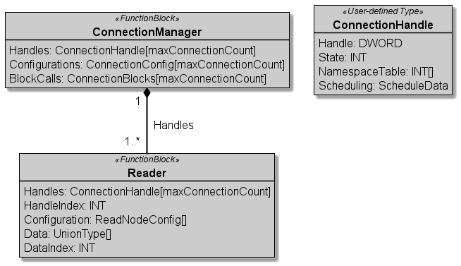

# :mortar_board: AUTOMATION SERVICE CHOREOGRAPHY

[:rewind:back](../README.md)

## :three: Software Pattern - Configurable Communication

**Name**  
*Name of the PLC Programming Pattern*

Value Registry Pattern

---

**Purpose**  
*Name of the PLC Programming Pattern*

...

---

**Use Case**  
*Describes the use case behind the pattern*

...

---

**Applicability**  
*Describes the usage context of the pattern*

...

---

**Structure**  
*Describes the structure of the pattern*

---

**Actors**  
*Introduce the involved software entities*

...

---

**Interaction**  
*Describes the interaction between the entities*

...

---

**Consequences**  
*Pros and Cons of the pattern*

...

---

**Implementation**  
*Hints for implementation of the pattern*

...

---

**Cross References**  
*References to other related patterns*

...

---

