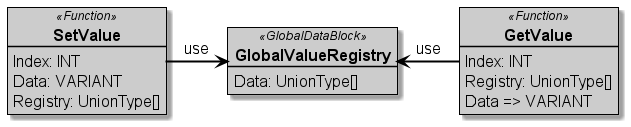

# :mortar_board: AUTOMATION SERVICE CHOREOGRAPHY

[:rewind:back](../README.md)

Editing Status: :construction: (under construction))

Last Modification: 09.05.2021

---

## :three: Software Pattern - Value Registry

**Name**  
*Name of the PLC Programming Pattern*

Value Registry Pattern

---

**Purpose**  
*Name of the PLC Programming Pattern*

This pattern is used to merge multiple information into a global array. This enable the forwarding of the global array and via indexing the used value out of the registry can be used.

---

**Motivation**  
*Reason to use this pattern*

The reason to use this pattern lay in the simplicity of configurable access for index values merged from multiple code parts.

---

**Applicability**  
*Describes the usage context of the pattern*

Merge of external and internal information into a single list to be able to select the required value by changing the index.

---

**Structure**  
*Describes the structure of the pattern*

---

**Actors**  
*Introduce the involved software entities*

The core entity is a Global Data Block, called *GlobalValueRegistry* which contains a list of *UnionType* that can be written by the *SetValue* Function or can be read by the *GetValue* Function.

*SetValue* as well as *GetValue* can be extended for extending error handling by missed or bad values.

---

**Interaction**  
*Describes the interaction between the entities*

The *SetValue* got access to the *GlobalValueRegistry* and writes its Data into the given Index of the Registry. 

The *GetValue* got also access to the *GLobalValueRegistry* and reads the given Index and provides it as requested Data.

---

**Consequences**  
*Pros and Cons of the pattern*

The advantage is of this pattern is the single point of access for all configurable data flows within a PLC Program. 

Disadvantage of this Pattern can also be named by higher memory footprints.

---

**Implementation**  
*Hints for implementation of the pattern*

An examplary TIA Portal Source Code will be published soon.

---

**Cross References**  
*References to other related patterns*

The pattern can be used in combination with the *Configurable Communication* to merge the external read and internal existing data to realize a single point of access object within the program. [see](../Part_3_1_ConfigurableCommunication/README.md)

---

