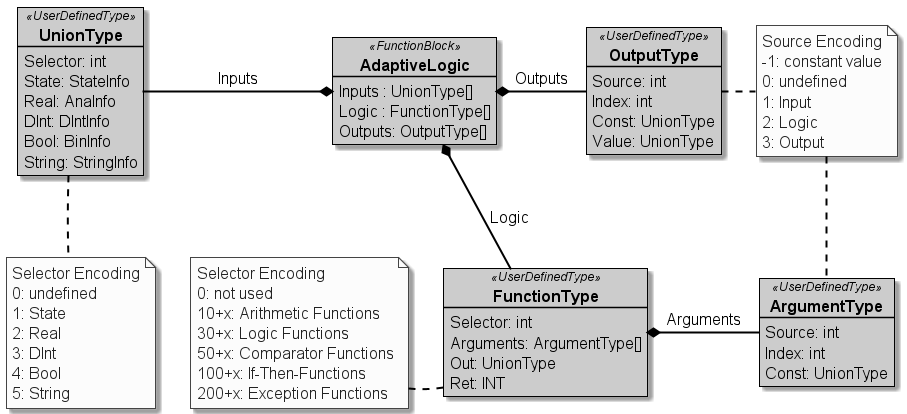

# :mortar_board: AUTOMATION SERVICE CHOREOGRAPHY

[:rewind:back](../README.md)

Editing Status: :construction: (under construction))

Last Modification: 25.07.2021

---

## :three: Software Pattern - Adaptive Logic

**Name**  
*Name of the PLC Programming Pattern*

Adaptive Logic Pattern

---

**Purpose**  
*Name of the PLC Programming Pattern*

This pattern is used to configure processing rules of information from a global data list to the related interface of any software part which requires an adaptable pre-processing of configurable information.

---

**Motivation**  
*Reason to use this pattern*

The reason to use this pattern can be attributed to the need to be able to pre-process information within PEA-to-PEA information exchange.
External read information can be pre-processed in multiple ways (logical or arithmetic calculation rather If-then rules) to adapt it to the internal, pre-tested and verified PLC program. A re-compile or re-load of the PLC Program for changing the configuration of the adaptive logic is not needed.

---

**Applicability**  
*Describes the usage context of the pattern*

This pattern will be used to configure pre-processing functionality in in runtime-defined PEA-to-PEA information exchange.

---

**Structure**  
*Describes the structure of the pattern*

---

**Actors**  
*Introduce the involved software entities*

The core is represented by the Function Block *AdaptiveLogic*. It contains three lists which represents Inputs, Logic and Outputs.

The list of Inputs constists of a list of *UnionType* that represents a global list of information as single point of access. The list of Outputs consists of *OutputType*, which contains the results of the Logic Functions or a defined constant value. The third list, the list of Logic, of a List of *FunctionType* represents a data type which is representative for the pre-processing function. 

---

**Interaction**  
*Describes the interaction between the entities*

The resulting pre-processing function which can be changed during commissioning or runtime is established by defined references between single list items our of those three lists.

The *OutputType* and the *FunctionType* can refer to entities in each of those three lists. Accodingly to this, any kind of pre-processing logic or function can be configured as long as the amout of pre-defined list elements are available.

---

**Consequences**  
*Pros and Cons of the pattern*

The advantage of this pattern is the huge freedom to configure any kind of pre-processing functionality, as long as the functionality is pre-defined and pre-implemented. All the existing *FunctionType*s to the point of desing can be configured as often as a free *FunctionType* is available. 

Disadvantaging is exactly this limitation, that the number of configurable pre-processing functions is limited as well as the amout of different *FunctionTypes* can only be changed by re-compile and re-load the PLC Program.

---

**Implementation**  
*Hints for implementation of the pattern*

An examplary TIA Portal Source Code will be published soon.

---

**Cross References**  
*References to other related patterns*

The pattern can be used in combination with the *GlobalValueRegistry* to realize a single point of access object for all the pre-processable information of external read or internal existing information. [see](../Part_3_2_ValueRegistry/README.md)

---

