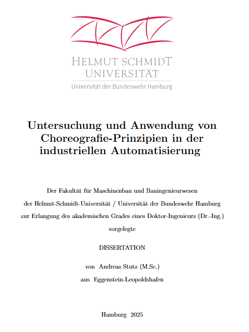

# Exploration and Application of Choreography Principles in Industrial Automation

## PhD Thesis - Additional Appendix and Example Code

Welcome to the repository with the additional appendix and the example code for my submitted PhD thesis "Exploration and Application of Choreography Principles in Industrial Automation" at the Helmut Schmidt University / University of the German Federal Armed Forces Hamburg.  

## Author Information

My name is Andreas Stutz and I am a researcher and innovator for software-defined plant automation at Siemens Process Automation. With creativity and initiative, I shape the transformation while bringing people and technologies together.

Feel free to contact me for feedback, comments or questions regarding my research work:  
- [LinkedIn](https://www.linkedin.com/in/andreas-stutz/)  
- [ResearchGate](https://www.researchgate.net/profile/Andreas-Stutz)

To simplify the reading of the additional appendix and summary of the Phd thesis, as well as additional content for some of my publications, github pages are prepared.

[Go to Website](https://stan1025.github.io/AutomationServiceChoreography/)