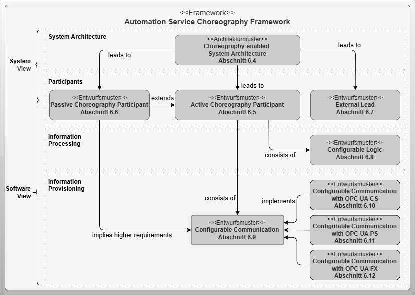

# Automation Service Choreography Framework

## Artifact Description

**Name:** Automation Service Choreography Framework  
**Artifact Type:** Framework  
**Target Users:** System Architects, Software Architects, PLC Programmers  
**Objective:** Development of the *Automation Service Choreography Framework* to present the components necessary for developing and implementing automation services. It describes individual components as sub-artifacts and illustrates their mutual dependencies. The goal is to provide a comprehensive representation of all individual components as an entry point for future developers and users of automation service choreographies.

## Overview

The *Automation Service Choreography Framework* provides the development framework that encompasses the required components of the described concept and presents relationships following a top-down approach. The framework consists of one architectural pattern and eight design patterns, organized into four content areas:

- **System Architecture**
- **Participants**
- **Information Processing**
- **Information Provisioning**

*Figure: Automation Service Choreography Framework and its Components*

## Framework Components

### Architectural Pattern

- **Choreography-enabled System Architecture**: Introduces the resulting system architecture and shows the impact of choreographed functions on service-based functional systems and their central orchestration in the POL (Process Orchestration Layer).

### Design Patterns

#### Participants

- **Active Choreography Participant**: Defines components, relationships, and tasks of an active choreography participant with capabilities for information transfer and processing.
- **Passive Choreography Participant**: Enables integration of legacy systems through decentralized orchestration by an active choreography participant.
- **External Lead**: Introduces a special automation service that plays an essential role in orchestrating choreographed functions when no available service can assume the leader role.

#### Information Processing

- **Configurable Logic**: Specifies the core of information processing and enables influence on native control programs and configurable behavior based on internal and external information.

#### Information Provisioning

- **Configurable Communication**: Abstract design pattern defining the foundation for configurable communication without focusing on specific technologies.
- **OPC UA Client/Server (CS)**: Technology-specific pattern using OPC UA Client/Server mechanisms based on PLCopen OPC UA Client building block specification.
- **OPC UA Publish/Subscribe (PS)**: Technology-specific pattern using OPC UA Publish/Subscribe mechanisms for one-to-many communication with push principle.
- **OPC UA Field Exchange (FX)**: Technology-specific pattern using OPC UA Field Exchange mechanism, specifically designed for the use case applied here.

## Key Design Decisions

### Dual Target Audience

The framework addresses both system architects and software architects/PLC programmers:

- **System View**: Covers System Architecture and Participants (for system architects)
- **Software View**: Additionally includes Information Processing and Information Provisioning (for software architects/PLC programmers)

### Modular Building Block System

Software components for configurable logic and communication are treated separately to enable flexible combination of multiple communication technologies. This supports targeted equipment of choreography participants with suitable communication mechanisms based on system strategy requirements.

## Application

### For System Architects

- Entry point: *Choreography-enabled System Architecture* pattern
- Design modular production systems with choreographed automation services
- Define framework conditions for software architects and PLC programmers
- Consider system implications and design options for choreography patterns

### For Software Architects/PLC Programmers

- Entry point: Participant design patterns
- Implement software components from Information Processing and Information Provisioning areas
- Flexible selection and combination of communication technologies
- Runtime composition of distributed functions based on system design requirements

## Benefits

- **Flexibility**: Modular approach enables adaptation to various application scenarios
- **Technology Independence**: Abstract patterns support different communication technologies
- **Legacy Integration**: Support for existing systems through passive participant pattern
- **Scalability**: Framework supports both simple and complex choreography scenarios
- **Standardization**: Based on established OPC UA standards and PLCopen specifications