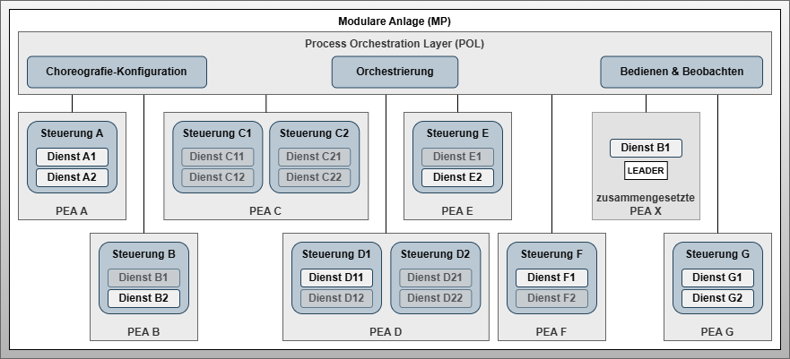

# Artifact - Choreography-enabled System Architecture

## Artifact Description

!!! highlight ""

    | Fact Sheet | |
    | :--- | :--- |
    | **Name** | Choreography-enabled System Architecture  |
    | **Artifact Type** | Design Pattern |
    | **Target Users** | System Architects |
    | **Objective** | This architecture pattern describes the application of automation service choreographies in the context of a modular plant and central orchestration. It provides insights into changes and influences through the use of choreographies in combination with central orchestration. Rigid equipment-oriented structures and boundaries blur due to composed functions that are formed across equipment boundaries. The transformation from current to future system architectures is presented using three figures. Current architectures are based exclusively on central orchestration. Future architectures use both central orchestration and choreographies for system automation. The purpose of the architecture pattern is to clarify the changes to future system architects and introduce the next level of detail of the concept. |

## Relevant Publications

## Components of the Artifact

*Figure 1: System architecture of a modular plant with a modular unit composed by choreography*

### Modular Plant

The *Modular Plant* represents the physical and software-based system that should be capable of manufacturing a product. It consists of the POL as well as several atomic and composite PEAs.

### Modular Units - PEA A, PEA G and Composite PEA X

The modular units *PEA A* and *PEA G* each describe a self-contained system that can provide services with automation functions of different granularity. Each PEA has at least one control system connected to the POL. Current PEAs are passive communication participants regarding their role in communication with the POL, hence existing systems are also called passive choreography participants. The active role of communication lies solely with the POL. This will need to change in the future for modular units in the context of choreographies.

For the *composite PEA X*, this will partially change in the future. Towards the POL, the *composite PEA X* remains a passive communication participant. As active choreography participants, the FEAs and COMPs within the composite PEA X gain the ability to act as active communication participants. This requires FEAs and COMPs to have their own control systems that meet these requirements while being adapted in performance to their specific needs.

### Control and the Concept of Choreography Participant

The *Control* describes the program-executing component within a *PEA*. Typically, *PEAs* have exactly one control system on which services are implemented and provided. However, it cannot be excluded that modular units also have two or more control systems.

An *active choreography participant* refers to a control system that has implemented the design patterns developed in this work. A *passive choreography participant* refers to a control system that has not implemented these design patterns.

### Services

A *Service* describes the encapsulation of an automation function through state-based abstraction and parameterization. Services also have input and output process values that can be linked together for control functions or interlocks.

### Process Orchestration Layer (POL)

The POL bundles the system functions necessary for operating the *Modular Plant*. Essential components include central *Orchestration*, *Operation & Monitoring*, and *Choreography Configuration*. The latter is added through the introduction of choreography mechanisms for composite PEAs.

#### Orchestration

The *Orchestration* enables coordination of services provided by the PEAs. Orchestration does not distinguish whether they are services of atomic or composite PEAs.

#### Operation & Monitoring

*Operation & Monitoring* provides a simple and clear way to look into the current process. Process diagrams enable plant operators to monitor the status and progress of production and intervene when necessary.

#### Choreography Configuration

The newly introduced *Choreography Configuration* describes a POL system function with which choreographies can be designed and activated. Activation includes transferring the configuration and initiating execution of configurable logic and configurable communication.

### Leader

When designing an automation service choreography, one service must act as *Leader*, representing the choreographed function to the POL and communicating with higher-level systems through its interface.

A service can assume the role of *Internal Lead* if its state matches that of the choreographed function. The other services act as followers. In cases where no single service can represent the entire function – such as in sequential processes – an *External Lead* is required.

## Design Decisions of the Artifact

### Focus on Runtime Technical Aspects

System architectural investigations showed that neither an implementation nor an engineering approach for automation service choreographies existed previously. A solid engineering methodology requires clear definition of what content is captured and how it can be transferred into technical implementation.

### Combination of Orchestration and Choreography

System architectural considerations raised the question of whether choreography should completely replace or supplement central orchestration. Comparison of both approaches shows that system complexity increases significantly with the number of services in choreographed systems.

While technically feasible, complete replacement of orchestration by plant-wide choreography has practical limitations due to information processing complexity and lack of clarity without supporting engineering methodology.

Therefore, this work limits choreography to combining FEAs and COMPs. Coordination of composite PEAs continues through central orchestration in the POL.

## Technical Details of the Artifact

The *composite PEA X* from Figure 1 can be implemented in various ways. Figure 2 shows a theoretical representation of all choreography patterns considered in this work, describing four patterns in total.

*Figure 2: Theoretical structure of a choreography of a composite modular unit with different occurring choreography patterns*

*Solid lines* describe connections between two active (choreography) participants. *Dashed lines* describe connections between active and passive (choreography) participants. Transparent services have no significance for choreography configuration and remain available to central orchestration.

### Four Choreography Patterns

**Pattern 1:** Modular unit (*FEA B and E*) with one active choreography participant. This unit has a single control system capable of participating in choreography.

**Pattern 2:** Modular unit with multiple controls (*FEA C*). Both controls are choreography-capable and participate as *active participants C1 and C2*.

**Pattern 3:** Represented by *FEA D*. The unit has two controls (D1 and D2). One is choreography-capable (*active participant D1*), the other is not (*passive participant D2*). The *active participant D1* serves as decentralized orchestrator for the *passive participant D2*.

**Pattern 4:** Variation of Pattern 3 with participants distributed across two modular units (*FEA E and F*). Both units form a participant pair consisting of *active participant E* and *passive participant F*.

The resulting system architecture from the POL perspective is shown in Figure 3:

*Figure 3: System architecture resulting from choreography usage and automation services available for orchestration*

## Application of the Artifact

Using automation service choreographies within a modular plant leads to blurring system boundaries of modular units (PEAs, FEAs, and COMPs). The design pattern introduces an implicitly existing system level below the POL, serving to form composite functions through distributed behavioral rules and configurable communication.

The blackbox of *composite PEA X* from Figure 1 is merged with various FEAs from Figure 2, resulting in the modular plant shown in Figure 3 with seven physical PEAs and one non-physically existing PEA formed through choreography.

*Services A1, A2, B1, B2, D11, E2, F1, G1, G2* are available to central *Orchestration*. Focus is on *Service B1*, which acts as *Leader Service* representing the choreography. *Follower Services C11, C12, C21, C22, D12, D21, D22, E1, and F2* are part of the choreography and not available to central *Orchestration*.

This type of choreographed composite PEA formation can be performed multiple times. There are exactly as many *Leader Services* as there are configured choreographies in the system.