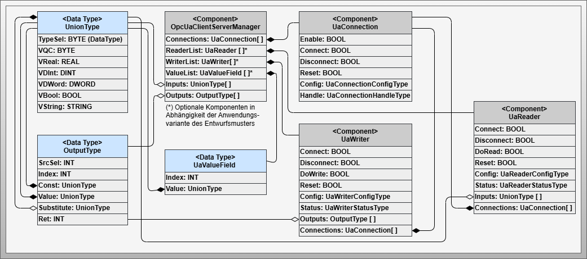
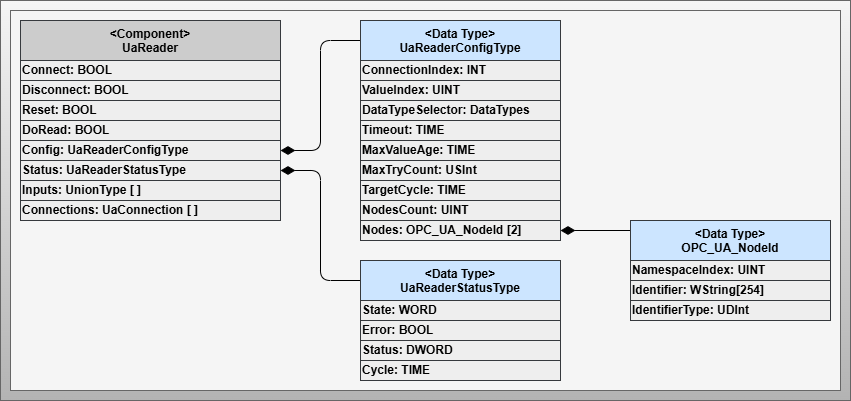
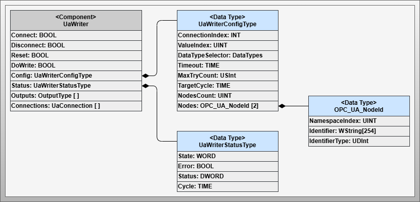
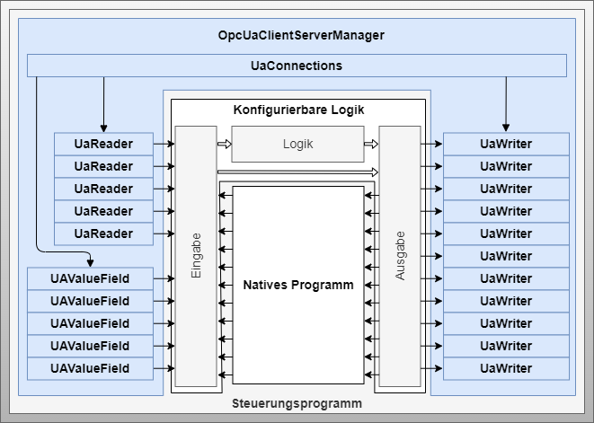

# Artifact - Configurable Communication with OPC UA CS

## Artifact Description

!!! highlight ""

    | Fact Sheet | |
    | :--- | :--- |
    | **Name** | Configurable Communication with OPC UA Client/Server (CS)  |
    | **Artifact Type** | Design Pattern |
    | **Target Users** | Software Architects, PLC Programmers |
    | **Objective** | This design pattern defines the concrete implementation for dynamically configurable OPC UA Client/Server communication. It describes information models, implementation patterns, limitations and possibilities. |

## Relevant Publications

## Artifact Description

The *Configurable Communication with OPC UA CS* design pattern describes an implementation of dynamically configurable OPC UA Client/Server connections including read and write functions. The pattern considers applicability on resource-constrained embedded control solutions. Corresponding mechanisms are provided to enable more efficient resource usage of the device and safe operation of communication.

The foundation of the patterns described here is the PLC Open OPC UA Client function block library. The configuration interface is provided through exposure of the configuration model in the integrated OPC UA Server of the controller.

The pattern offers possibilities to:

- Read information from other active choreography participants and transfer it to the input list
- Write information from the output list to other choreography participants  
- Include passive choreography participants in the sense of decentralized orchestration when they only have an OPC UA Server

## Artifact Technological Conditions

Industrial control systems are subject to constraints such as limited system resources, IEC 61131 programming language requirements, and pre-compiled control software. This limits the use of OPC UA Client/Server connections regarding the number of connections and information to be read or written.

Industrial controllers limit the number of connections, write and read operations. The number of reading and writing operations can be increased through scheduling at the cost of update rate. A scheduling mechanism for connections offers no significant advantage due to the duration of connection setup/teardown and resource release. Block optimization of information to be read and written requires dynamic allocation of memory areas, which is not supported by all control platforms.

The design pattern must use system resources efficiently and comply with limits. These constants must be defined by the developer during PEA engineering, considering the system resources available in the control system.

## Artifact Building Blocks

The design pattern consists of 15 components in total, shown in four figures:

### Main Components Overview

*Figure: Components of the OPC UA Client/Server specific design pattern for configurable communication*

### Connection Management Focus

*Figure: Components and data types with focus on connection management*

### Reader Processing Focus

*Figure: Components and data types with focus on read operation processing*

### Writer Processing Focus

*Figure: Components and data types with focus on write operation processing*

### OpcUaClientServerManager Component
The central component that concretizes the core component of the abstract design pattern. Implements core functions for connection, reader, and writer management.

### UaValueField Data Type
Describes a variable where other choreography participants can write values. These values are transferred to the specified input list element during component execution, serving as a passive input channel.

### UaConnection Component
Bundles all necessary mechanisms for managing, executing, and monitoring an OPC UA connection.

### UaReader Component
Describes all necessary variables and data structures for managing, executing, and monitoring a read operation of process value and quality code information from another choreography participant.

### UaWriter Component
Describes all necessary variables and data structures for managing, executing, and monitoring a write operation of process value and quality code information to another choreography participant.

## Artifact Decisions

### Bus-like Function Block Structure and Scheduling
To optimize resource usage, a bus-like structure is introduced where each reader and writer gets access to the connection handle list and is assigned to a connection via configuration. This enables more flexible use of available resources and requires scheduling to prevent system overload when maximum limits are exceeded.

### Variable NodeCount for Reading and Writing
Between choreography-enabled control systems, information is always exchanged as a combination of process value and status in UnionType format. For integration of legacy systems as passive choreography participants, a NodeCount setting determines whether process values are addressed with or without status information.

## Artifact Implementation Details

### Bus-like Interaction Structure

*Figure: Bus-like interaction structure between the three main components*

Flexibility is achieved through a bus system-inspired function block structure. Technical constraints limit the number of connections, reader/writer operations, and value fields. Assignment is done configuratively, with each reader and writer determining an ID within its bus line for scheduling purposes.

### Scheduling Mechanism

*Figure: Example scheduling with round-robin method - six operations and five execution slots*

Internal scheduling ensures that the maximum number of simultaneous read and write operations on a connection is not exceeded. A round-robin algorithm is used, which can be replaced with other scheduling approaches implementable in IEC 61131 environments.

### Communication Workflow

#### Connection Workflow

*Figure: Workflow for OPC UA connection processing*

The connection starts in *Disconnected* state. With *Connect* activation, the setup process begins through *Configuring*, *Connecting*, and *GetNamespaceTable* states. In the active *Executing* state, the connection is monitored and readers/writers are coordinated by the scheduler.

#### Reader/Writer Workflow

*Figure: Workflow for OPC UA Reader/Writer function processing*

The process begins in *Uninitialized* state. After connection initialization, reader/writer transitions to *Initializing*, registers, and determines ID. After successful registration, *Idle* state is reached, waiting for *Connect* command.

## Artifact Application

*Figure: Application of the OPC UA Client/Server specific design pattern*

The pattern supports four application variants:

1. **Active Reading**: Uses `UaReader` component to read information from other choreography participants
2. **Active Writing**: Requires `UaValueField` and `UaWriter` components for active writing to passive targets
3. **Active Reading and Writing**: Combination of both approaches
4. **Decentralized Orchestration**: Special variant for integrating passive choreography participants

### Pull Principle
Read operations fail directly upon connection failure, allowing immediate integration into processing and prompt countermeasures.

### Push Principle
The processing side must provide application-level communication monitoring mechanisms. The age of each information is cyclically checked to determine if the last transmission exceeded the allowable age limit.

## Artifact Pros/Cons

**Advantages:**
- OPC UA Client/Server is the most common approach and widely used in industrial automation
- Efficient resource usage through flexible assignment mechanisms
- No additional connection monitoring mechanisms required due to active communication role
- Supports integration of passive choreography participants
- Manufacturer-neutral applicability following PLC Open OPC UA specification

**Disadvantages:**
- Industrial control systems often designed as OPC UA Server, not Client
- OPC UA Client functions less widespread and may not support PLC Open specification
- Limited system capacities require significant coordination effort
- Runtime configuration may not be possible with proprietary, statically configured systems

