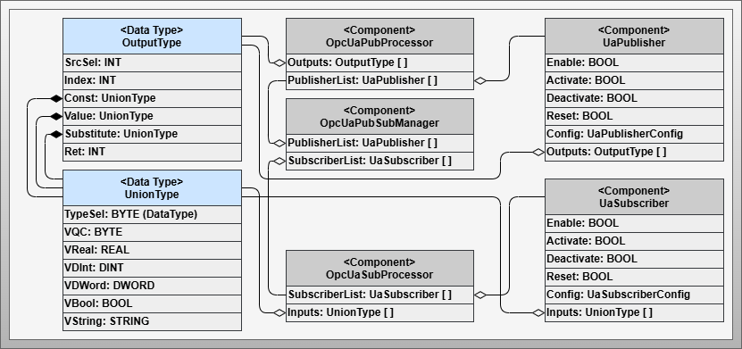

# Artifact - Configurable Communication with OPC UA PS

## Artifact Factsheet

!!! highlight ""

    | Fact Sheet | |
    | :--- | :--- |
    | **Name** | Configurable Communication with OPC UA Publish/Subscribe (PS) |
    | **Artifact Type** | Design Pattern |
    | **Target Users** | Software Architects, PLC Programmers |
    | **Objective** | This design pattern defines the concrete implementation for dynamically configurable OPC UA Publish/Subscribe transmission. It presents information models, implementation patterns, and the boundaries and application possibilities. |

## Relevant Publications

This section introduces the design pattern for configurable communication based on OPC UA Publish/Subscribe. Parts of this section are published in [SKB+22].

## Artifact Description

The design pattern *Configurable Communication with OPC UA PS* enables dynamic configuration of OPC UA PS transmissions. It defines publishers and subscribers that serialize information according to the OPC UA specification and transmit it via UDP. Both unicast and multicast addresses are supported. Processing occurs entirely within the user program, with serialized data packets transmitted/received via operating system-integrated UDP communication mechanisms.

Publishers send data from the output list. Subscribers receive data and transfer it to the input list. Connectionless communication requires additional mechanisms to check and mark outdated information as unsafe, making communication problems detectable.

## Artifact Technological Conditions

In this implementation variant, serialization and deserialization occur directly in the control program. Serialized information is transmitted as native UDP telegrams. A standard library specification for OPC UA PS, analogous to OPC UA Client functions, does not exist. However, some control vendors provide building block libraries for publishers and subscribers that implement standard serialization.

The number of transferable union values must be defined during engineering, considering maximum UDP connections that vary by manufacturer and control type. As a framework condition for dynamically configurable direct information transfers, exactly one UnionType is processed per dataset. Each publisher and subscriber can only process one group with one reader or writer and one dataset. Therefore, a dedicated publisher and subscriber is required for each piece of information to be exchanged.

## Artifact Building Blocks

The design pattern consists of 5 components and several data types shown in the following sub-sections and three figures:

### OpcUaPubSubManager

Central component representing the core of the design pattern. Provides access to publisher and subscriber lists for configuration and monitoring of information transmission.

*Figure: Components and data types of the OPC UA Publish/Subscribe specific design pattern for configurable communication*

### UaPublisher

Sending component that transmits output information to other choreography participants and their subscribers.

*Figure: Component and data types of the OPC UA Publisher*

### OpcUaPubProcessor

Execution control software component for OPC UA Publishers. Executes configured publishers and establishes connection to the output list.

### UaSubscriber

Receiving component that receives information from other choreography participants and transfers it to the corresponding input list element.

*Figure: Component and data types of the OPC UA Subscriber*

### OpcUaSubProcessor

Execution control software component for OPC UA Subscribers. Executes configured subscribers and establishes connection to the input list.

## Artifact Decisions

### Introduction of Execution Control Components

IEC 61131 defines continuous and timed execution cycles. UDP communication in IEC 61131 environments is OS-integrated and used through function blocks. Received telegrams must be continuously retrieved, while send telegrams are transmitted cyclically. Therefore, publishers and subscribers have separate processor components for flexible integration.

### Single Information Transfer per Publisher/Subscriber

For maximum flexibility in transporting arbitrary information, point-to-point transmission is required. Since IEC 61131 programs cannot dynamically form optimized information blocks, individual transmission is necessary. Each publisher sends exactly one UnionType value, and each subscriber receives exactly one UnionType value.

### UDP Transmission Usage

OPC UA PS supports transmission via both UDP and MQTT. UDP is chosen as a connectionless protocol preferred when speed is more important than reliability, requiring no additional infrastructure unlike MQTT brokers.

## Artifact Implementation Details

### Processing Integration

*Figure: Integration into different execution contexts for this design pattern*

To minimize latency, subscribers are integrated at the beginning of the application program in a fast execution context (e.g., OB1 in SIMATIC S7). Publishers, on the other hand, are executed at the end of the application program in a cyclical context, for instance, every 100ms.

### Component Interaction

The OpcUaPubSubManager serves as single point of access for configuration and monitoring. Processor components handle execution and value transfer between output/input lists and the network components.

### Communication Monitoring

Uses push-case monitoring where timestamps are checked for each piece of information. If timestamps exceed defined timeframes, communication is considered disrupted. Monitoring results are entered in the input list with corresponding behavioral rules.

## Artifact Application

*Figure: Application of the OPC UA Pub/Sub-specific design pattern for implementing incoming and outgoing information following the active choreography participant design pattern*

The pattern connects incoming and outgoing information between active choreography participants using OPC UA Publish/Subscribe mechanisms. Each participant is extended with publishing and subscribing capabilities. The output list of configurable logic is transmitted by publishers to subscribers, which capture network telegrams and forward received data to the logic's input list.

This design pattern is suitable for choreography implementation when the described limitations (passive participant integration, security constraints) are not exclusion criteria. For use cases where these boundaries have no consequences, the OPC UA PS pattern can achieve efficient solutions with very low latency times.

## Artifact Pros/Cons

**Advantages:**

- Extremely low latency times for information transmission
- Integrated application approach simplifies usage
- Efficient solution for specific use cases

**Disadvantages:**

- Limited to one UnionType information per publisher/subscriber
- Security risks due to inability to implement OPC UA Security mechanisms in real-time control programs
- Bidirectional configuration required
- Not suitable for integrating passive choreography participants

