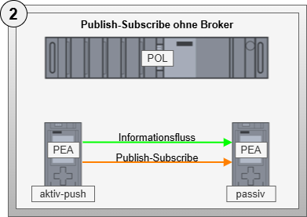
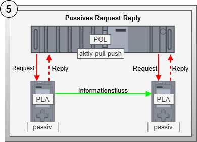

# Artifact - Configurable Communication

## Artifact Description

!!! highlight ""

    | Fact Sheet | |
    | :--- | :--- |
    | **Name** | Configurable Communication |
    | **Artifact Type** | Abstract Design Pattern |
    | **Target Users** | Software Architects, PLC Programmers |
    | **Objective** | This design pattern defines fundamental properties and requirements for concrete communication technologies to be implemented. Automation service choreographies with multiple participants require information exchange that is dynamically configurable. The underlying technology is secondary; therefore, this pattern describes requirements and basic considerations for configurable communication. |

## Relevant Publications

<!-- 
The abstract design pattern *Configurable Communication* establishes the foundations for information transfer between choreography participants. It is abstract because it defines general principles and building blocks that must be implemented in technology-specific patterns. The scope also includes an analysis of various communication patterns from which framework conditions for protocol-specific implementations are derived. For automation service choreographies, the technology used is secondary; what matters is adherence to the fundamental principles and building blocks described below. -->

## Pattern Components

Depending on the communication principle (Push/Pull), one of the abstract base components shown in Figure 1 must be selected for the active communication partner side.

### Abstract Component - Configurable Communication (Push)

The abstract component *Configurable Communication (Push)* describes an active communication partner that transmits information from the output list to a defined communication partner. Following this principle, communication partners actively send data from their information inventory. The output list and the associated union value of configurable communication are used. Therefore, the component consists exclusively of a list of output types.

### Abstract Component - Configurable Communication (Pull)

The abstract component *Configurable Communication (Pull)* describes an active communication partner that specifically retrieves information from another partner (Pull) and transfers it to the input list as a union value according to the specified index. The active communication partner has access to all information from the input list of the other partner, provided it has been configured accordingly. Therefore, this component comprises exclusively a list of input types.

### Abstract Component - Configurable Communication (Push/Pull)

The abstract component *Configurable Communication (Push/Pull)* combines the functions of an active communication partner that can both retrieve information from other partners (Pull) and forward it to them (Push). It thus combines the capabilities of pure Push and Pull variants.

## Design Decisions

### Abstract Description of Communication

During the work, the diversity of design possibilities that can be applied for implementing controller-to-controller communication becomes apparent. Describing every possibility is not conducive for a scientific work on transferring choreography principles to industrial automation. This step corresponds more to a developmental rather than a scientific question. Nevertheless, a developer needs certain framework conditions and guidelines for transferring a concrete communication technology to be able to use the communication technology in the context of automation service choreographies.

For this reason, the decision was made to introduce an abstract design pattern that defines universally valid foundations necessary for the concrete implementation of communication technologies.

## Technical Details

As technical details of the abstract design pattern, universally valid specifications and the results of an investigation of typical communication patterns are described. Both form the basis for adapting concrete communication technologies.

### Specifications for Configurable Communication

The specifications described below serve future developers as orientation and guidelines for implementing concrete communication technologies. They emerged during a retrospective of three technology-specific design patterns and form an initial set of experience characteristics that can be used for future technology-specific implementations. At the same time, this means that this list does not claim to be complete - it is an initial collection of experiences from developing three technology-specific design patterns.

**Specification 1**: Requires that at least one communication technology is provided for an active choreography participant. The possibilities of the control platform and the suitability of the technology must be considered. It is also possible to integrate multiple communication technologies within one participant.

**Specification 2**: Demands the exchange of information between active choreography participants. Depending on the communication technology, this exchange occurs either in Push or Pull mode, with one partner taking the active role and the other the passive role. With the Pull principle, values are entered in the input list, while with the Push principle, information comes from the output list.

**Specification 3**: Considers the limitations of IEC 61131-based control systems and requires that the developer of a choreography-capable control program already determines the number of transferable union values during engineering. The required connection and transmission resources must be prepared at the time of compiling and loading the program.

**Specification 4**: Requires indexing of internal and external information in the input and output lists. Each entry must be identifiable by a unique index. Every union value exchanged via a protocol-specific implementation must be assigned to a defined element of the input or output list.

**Specification 5**: Requires that the transmission of each union value is configurable according to protocol specifications. This configurability ensures that active choreography participants can be linked together after compiling and loading the control program.

**Specification 6**: Requires provision of diagnostic information for each value to be exchanged. Additionally, it is recommended to provide collective error information at a central component.

**Specification 7**: Requires provision of statistical information with the number of union values available for exchange and the number of currently active transmissions of union values. Additional protocol-specific statistical information can be provided as needed.

### Investigation of Typical Communication Patterns

When transmitting information in an automation service choreography, various constellations regarding the active and passive sides of communication as well as Push and Pull principles must be considered. The five communication patterns shown below emerge from these criteria, each with different advantages and disadvantages. Each pattern is evaluated based on the criteria described in the evaluation criteria table.

## Communication Pattern Variants

| Pattern | Description |
|---------|-------------|
|  | **Variant 1: Publish-Subscribe with Broker** - Describes communication between participants using a Publish-Subscribe pattern, where telegrams are routed through a central broker. |
|  | **Variant 2: Publish-Subscribe without Broker** - Describes direct communication between participants using a Publish-Subscribe pattern. |
|  | **Variant 3: Request-Reply as Active Writing (Push)** - Describes communication between choreography participants through exclusively writing activities. |
|  | **Variant 4: Request-Reply as Active Reading (Pull)** - Describes communication between choreography participants through exclusively reading activities. |
|  | **Variant 5: Passive Request-Reply** - Describes communication through the application of a third entity that can actively read and write, with participants being passive communication partners. |

## Evaluation Criteria

| **Criterion** | **Description** |
|---------------|-----------------|
| **Active Role** | Evaluates whether the active role of transmission lies on the information processing side. This is particularly advantageous for monitoring when the information-processing side also provides the active side of communication. |
| **Monitorability** | Evaluates what monitoring possibilities are available on which side of the transmission. Ideally, monitoring mechanisms exist on the side processing the transmitted information. |
| **Implementation Effort** | Evaluates what efforts the control program developer faces for implementing necessary components. Ideally, efforts should always be minimal. |
| **Configuration Effort** | Evaluates what efforts arise regarding configuration of the communication pattern. Ideally, efforts should always be minimal and preferably necessary only on the processing side. |
| **Theoretical Latency** | Evaluates what theoretical latency underlies the communication pattern. This is formed based on a sum of processing times along the path of information transmission using a reference system. Ideally, latency should be as low as possible. |

## Evaluation Results

| **Criterion** | **Preferred Pattern** | **Justification** |
|---------------|----------------------|-------------------|
| **Active Role** | Variant 4 | Variant 4 with active reading represents the only variant where the active role of transmission lies on the information processing side. |
| **Monitorability** | Variant 4 | Variant 4 has a direct possibility to monitor transmission and react directly to errors in information processing due to the active role on the processing side and Request-Reply interaction. |
| **Implementation Effort** | None | Fully integrated operating system solutions are expected to cause the least effort. Partially integrated solutions combining operating system and user program integration require less effort than fully user-programmed solutions, which cause the greatest development effort. |
| **Configuration Effort** | None | It is recommended to choose a technology that only needs to be configured on the active communication partner side. |
| **Theoretical Latency** | Variant 2 | Variant 2 has the smallest expected latency. |

### Pattern Prioritization

Based on the analysis and considering ideal properties, the following prioritization of variants emerges (from most suitable to least suitable):

1. **Variant 4** - Request-Reply with Active Reading
2. **Variant 3** - Request-Reply with Active Writing
3. **Variant 2** - Publish-Subscribe without Broker
4. **Variant 1** - Publish-Subscribe with Broker
5. **Variant 5** - Passive Request-Reply

## Pattern Application

The abstract design pattern serves primarily as a development guideline for developing technology-specific implementations of configurable communication. Following the investigation of communication patterns, possible communication technologies were researched and initially evaluated.

### Overview of Possible Communication Technologies

The following technologies were identified as potential candidates for the five possible communication patterns:

| **Communication Pattern** | **Technologies** |
|---------------------------|------------------|
| **Publish-Subscribe with Broker** | MQTT, OPC UA Pub/Sub with MQTT, OPC UA FX (with Pub/Sub) |
| **Publish-Subscribe without Broker** | DDS, OPC UA Pub/Sub with UDP, OPC UA FX (with Pub/Sub) |
| **Request-Reply as Active Writing (Push)** | REST, OPC UA Client/Server, OPC UA FX (with Client/Server) |
| **Request-Reply as Active Reading (Pull)** | REST, OPC UA Client/Server, OPC UA FX (with Client/Server) |
| **Passive Request-Reply** | REST, OPC UA Client/Server |

Due to the widespread use of OPC UA mechanisms in industrial controls, the technology-specific criteria for the three variants OPC UA Client/Server, OPC UA Publish/Subscribe, and OPC UA FX are evaluated below.

### OPC UA Client/Server (CS)

Configuration effort is minimal with OPC UA Client/Server since only the OPC UA Client needs to be configured. However, when using security mechanisms, bilateral efforts arise through certificate exchange. Implementation effort for developers is also low since no efforts arise on the OPC UA Server side, and the OPC UA Client is usually simplified through building block libraries such as the PLC Open OPC UA Client specification.

### OPC UA Publish/Subscribe (PS)

With OPC UA Publish/Subscribe, configurations are required on both Publisher and Subscriber sides since UDP addresses and OPC UA-specific settings are necessary. Implementation-wise, efforts arise on both sides since UDP is usually only operating system-integrated and communication is implemented in function blocks in the user program.

### OPC UA Field Exchange (FX)

Since no commercial products exist for OPC UA FX in control systems, the analysis is based on prototypical developments. At the time of this work, only the application for OPC UA Publish/Subscribe was specified. Configuration effort is required on both sides, but the OPC UA FX Orchestrator handles the configuration. Implementation effort is currently difficult to quantify since prototypes do not allow representative evaluation.

### Selection of Communication Technologies to Consider

Based on the described investigation and evaluation of communication patterns as well as available applicable technologies, the decision was made to develop technology-specific design patterns for OPC UA Client/Server, OPC UA Publish/Subscribe, and OPC UA FX for the continuation of this work.