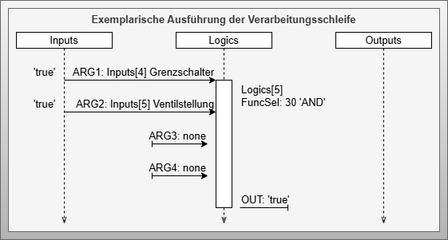
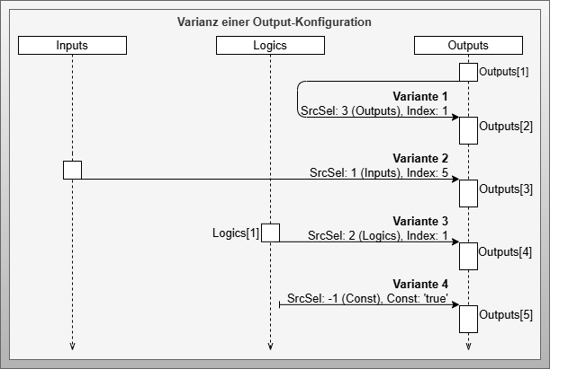

# Artifact - Configurable Logic

## Artifact Description

!!! highlight ""

    | Fact Sheet | |
    | :--- | :--- |
    | **Name** | Configurable Logic |
    | **Artifact Type** | Design Pattern |
    | **Target Users** | Software Architects, PLC Programmers |
    | **Objective** | This artifact defines the models and functional features of configurable logic, a central element of an active choreography participant. It enables the execution of configurable behavioral rules that determine a participant's role within the choreography. The software structures and their interactions are described in detail. |

## Relevant Publications

## Artifact Description

The *Configurable Logic* design pattern follows an execution principle similar to a programmable logic controller (PLC). It has an input side that bundles information from the native program or provided by configurable communication. This information, along with known data within the configurable logic, is processed in a logic list with configurable function elements. The output side provides necessary information for influencing the native control program or transmission to external participants, utilizing all known information within the configurable logic (input list) and processing results (logic list).

## Artifact Technological Conditions

## Artifact Building Blocks

The *Configurable Logic* design pattern consists of one component, four data types, and four enumerations:

### Component - Configurable Logic

The *Configurable Logic* component implements configurable input-processing-output functionality. It includes:

- **Inputs**: Information from native program or other participants
- **Logics**: Configurable functions with four arguments
- **Outputs**: Results for transfer to native program or other participants
- **Execute**: Variable to execute the configuration
- **ErrorAct** and **ErrorNum**: Report configuration and execution errors

### Data Type - UnionType

The *UnionType* data type represents information with different data types, as the type of information is not yet determined at control program compilation time. Variables are defined for data types REAL, DINT, DWORD, BOOL, and STRING with prefix *V**. The *VQC* variable contains the Quality Code, and *TypeSel* indicates the currently valid data type.

### Enumeration - DataTypes

The *DataType* enumeration defines the data type of *UnionType* within configurable logic, processed as byte constants.

### Data Type - FunctionType

The *FunctionType* represents a configurable function with uniform function signature. It defines the function and its result, where *Args* provides four input arguments. Results are provided via *Out* variable, and *RET* shows processing errors.

### Data Type - ArgumentType

The *ArgumentType* describes information for a function argument. Fields *SrcSel* and *Index* function as pointer information to retrieve arguments from input, processing, or output lists. Through references to the processing list, *FunctionType* elements can be chained for complex expressions. The *Const* variable allows configuring arguments as constants.

### Enumeration - FunctionTypes

The *FunctionTypes* enumeration defines the function to be applied by a *FunctionType* signature, determining how four arguments are processed and mapped to the output variable.

### Enumeration - SourceTypes

The *SourceTypes* enumeration defines the source location of information used as arguments in function signatures. Options include the three configurable logic lists (*Input*, *Logic*, *Output*), constants (*Const*), or unused arguments (*None*).

### Data Type - OutputType

The *OutputType* describes output information with multiple functions:

- *SrcSel* and *Index*: Determine output source from input, processing, or output lists
- *Const*: Set constant values
- *Value*: Store values after updates
- *Substitute*: Define replacement values to prevent unwanted activations during errors
- *Ret*: Report errors

### Enumeration - ErrorCodes

The *ErrorCodes* enumeration defines checked error cases and corresponding error codes for configuration diagnosis and execution monitoring.

## Artifact Decisions

### Number of Arguments

The *FunctionType* uses four arguments based on analysis of necessary functions. This represents a compromise between flexibility and memory consumption.

### UnionType as Structure

To avoid issues with generic data types not uniformly supported by all control manufacturers, the *UnionType* is introduced as a quasi-generic data type enabling better diagnostics at the cost of memory usage.

### Variable Types in UnionType

Five data types are defined (REAL, DINT, DWORD, BOOL, STRING) based on use case analysis. Additional types can be added but increase memory requirements.

## Artifact Implementation Details

### Integration into Control Program

Configurable logic integrates as a function block into the processing phase of cyclic control systems following the input-processing-output principle. Relevant information must be transferred to the input list before execution, and results are provided via the output list after execution.

### Internal Component Execution

The component operates with two sequential loops:

#### Processing Loop

Each logic list element is processed sequentially. Configured functions process up to four arguments, storing results in the Out variable.

#### Chained Processing

Elements are processed in list order, enabling information chaining for complex expressions.

#### Argument Source Variations

Arguments can reference elements from input, logic, or output lists, or use constants.

#### Output Loop

The second loop processes output elements using configurable pointer information (*SrcSel* and *Index*).

#### Output Source Variations

Similar to *ArgumentType*, *OutputType* can use various information sources or constants.

#### Substitute Value Function

*OutputType* provides substitute values defined by developers as safe fallbacks during calculation or configuration errors, preventing unexpected behavior.

## Artifact Application

The *Configurable Logic* artifact requires integration into industrial control application programs, preferably as a dedicated function block implementing the input-processing-output structure.

Integration follows a cross-connection pattern between the native program and configurable logic:

Before execution, all relevant information from the native program must be transferred to the configurable logic input list. After execution, output information is transferred back to the native program from the configurable logic output list.

---

*Note: Detailed descriptions and tables for each component are available in the referenced appendices of the original document.*

## Artifact Pros/Cons

