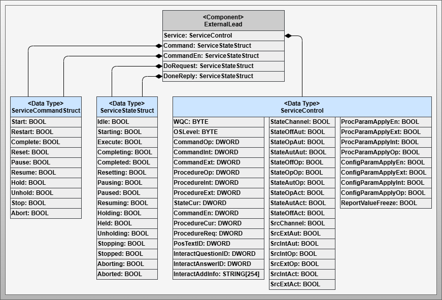
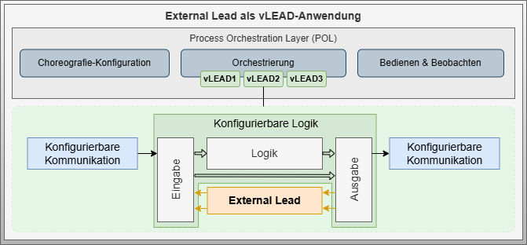

# Artifact - External Lead

## Artifact Description

!!! highlight ""

    | Fact Sheet | |
    | :--- | :--- |
    | **Name** | External Lead |
    | **Artifact Type** | Design Pattern |
    | **Target Users** | System Architects, Software Architects, PLC Programmers |
    | **Objective** | This design pattern describes a special design of a service that is conceived to consolidate information flows starting and ending at different choreography-participating services. It provides the ability to initiate these information flows through a Do-Request of a state and recapture them through a Done-Reply. This offers a way to provide the choreography state-correctly to the Process Orchestration Layer. |

## Relevant Publications

## Description

The **External Lead** design pattern describes a special implementation variant of an automation service that makes choreographies without a dedicated leader-capable service orchestrable for central orchestration. This service is not involved in the actual choreographed function in its role, but serves as an interface for transferring choreography information to a higher-level system.

The External Lead can trigger behavioral changes in follower services via Do-Requests and receive feedback about successful execution of these changes via Done-Replies. The External Lead adapts its state according to the state machine and can access all required parameters, process values, and report values of the services involved in the choreography for parameterization of the choreographed function.

This design pattern is described based on MTP interface components but is not limited to their use. The External Lead principle can also be applied to other standardized or proprietary interface concepts.

## Pattern Components

*Figure: Design pattern for External Lead with ServiceControl interface and four variables for the Do-Done interaction pattern*

### Component - External Lead

The External Lead component consists of five structured variables:

- **ServiceControl**: Variable for external service control
- **DoRequest** & **DoneReply**: Structured variables for interaction with other choreography participants, each containing a binary variable per state machine state
- **CommandEn**: Structured variable for enabling state transitions through control engineering connections
- **Command**: Structured variable for state transitions triggered from within the choreography

The DoRequest and DoneReply variables are based on the `ServiceStateStruct` data type, while Command and CommandEn are based on the `ServiceCommandStruct` data type.

### Data Type - ServiceControl

The ServiceControl data type corresponds to the MTP standard interface for an Automation Service. It contains variables for procedural control, service mode, and parameter management (details in VDI2658-4).

### Data Type - ServiceStateStruct

The ServiceStateStruct data type contains binary information for each state of the MTP state machine of an automation service. The state machine consists of 16 states total:

- 8 transient states
- 7 static states  
- 1 configurable state (transient for self-terminating procedures, static for continuous procedures)

### Data Type - ServiceCommandStruct

The ServiceCommandStruct data type contains binary information for each state transition of the MTP state machine. The state machine consists of 22 state transitions:

- 10 self-activating transitions
- 12 trigger-activated transitions with 10 triggers

## Design Decisions

### Use of State-Oriented Do-Done Interaction Pattern

The Do-Done interaction pattern enables the consolidation of two automation services that represent the beginning and end in a sequence. While the initial service is activated by the Do-Request, the end service is returned via the Done-Reply. Additional automation services can be chained in between. A Do and Done pair for each state enables configuration of procedural relationships and exception handling sequences.

## Technical Details

### State Machine

*Figure: Service state machine of the External Lead based on VDI2658-4*

The External Lead based on VDI2658-4 has a standardized state automaton for implementing state-based function abstraction. Behind each state is typically a sequence following step-transition logic for executing a procedural function. These sequences are initiated by a Start signal and reported as finished by an End signal, which are now openly available for interconnection with other choreography-participating services.

### Do-Done Relation Sequence

*Figure: Sequence diagram of an exemplary Do-Done relation of an External Lead using the Execute state*

Do-Done relations allow consolidation of different beginnings and ends of choreography relations between multiple automation services. Service 1 monitors the DoRequest.Execute information and executes a start when this information becomes true. At the end of sequential execution of Service 1, Service 2, and Service 3, the Completed information of Service 3 is used to activate the DoneReply.Execute of the External Lead.

### Command Enable Relations

*Figure: Sequence diagram of an exemplary CommandEn relation using the Start state transition*

Configurable behavior rules can determine conditions from available information that provide different enables for triggering state transitions. Start enables of choreography-participating services are linked via AND logic to the CommandEn.Start information of the External Lead, ensuring choreography can only start when all participating services can also start.

### Internal Command Links

*Figure: Sequence diagram of an exemplary Command relation using Abort exception handling*

Internal state transitions can be triggered from available information. Aborting and Aborted states of choreography-participating services are linked via OR logic to the Command.Abort information of the External Lead, ensuring that if a service enters abort exception handling, the leader is notified and also switches to this state.

## Application Variants

### PEA-Integrated Variant

*Figure: Application embedded in the control program of a PEA*

An External Lead is placed parallel to the native program between the input and output of the configurable logic. DoRequests are provided in the input and DoneReplies in the output of the configurable logic.

### Virtual Controller (vPLC) Application

*Figure: Application as sole implementation in a virtual controller control program*

Similar to the PEA-integrated variant, but the External Lead serves as the only software module between input and output of the configurable logic. This can be implemented as a vPLC and provided as a container, allowing External Lead containers to be instantiated in virtual environments as needed.

### Virtual Lead in POL

*Figure: Application as virtual services within the POL*

Based on virtual services concepts, virtual leads can be introduced in the POL. The External Lead is not a functional component of the choreography but merely packages it in procedural encapsulation. The signals are not subject to critical latency requirements and can be executed in the POL as a virtual lead.

## References

- Content partially published in [SBM+22] and [BSF+22]
- Based on MTP specification for automation services [VDI2658-4]
- Virtual services concept from [GHI+19]