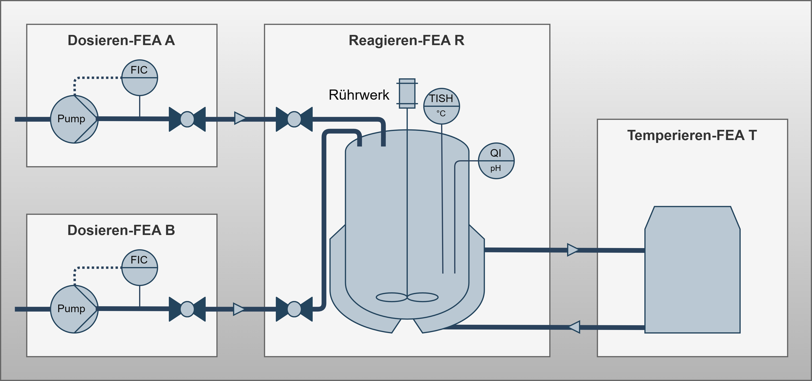
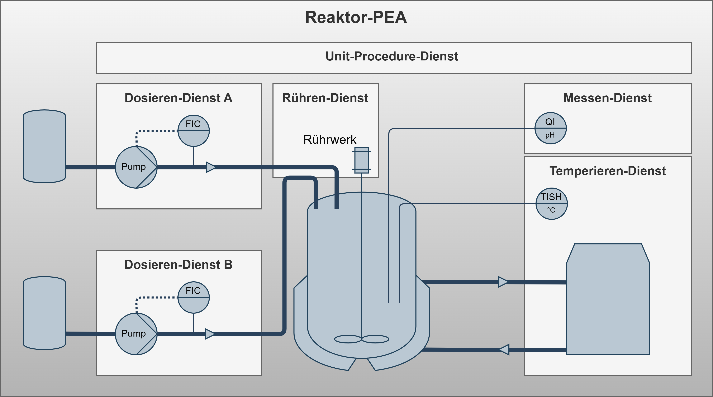
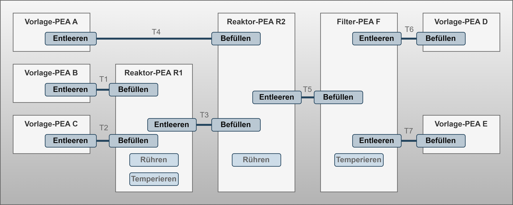

# Context & Use Cases under Investigation

## Overview

This document summarizes the three central use cases that were analyzed as part of the problem understanding. These examples serve amoung others as the basis for deriving requirements for a solution to integrate automation services within there FEAs and COMPs into PEAs and modular production systems.

---

## Use Case: Modular PEA

This use case describes the execution of a neutralization reaction consisting of four Functional Equipment Assemblies (FEAs). It is relevant for applications in laboratories, pilot plants, and production environments within the specialty chemicals and pharmaceutical industries. The details for this scenario were gathered from interviews with responsibles of the stakeholder group.

### Relevance and Benefits

This use case offers significant benefits, such as easier and faster adaptation to changing process conditions and material properties, as well as improved reusability of existing equipment. This ultimately results in a long-term reduction of investment costs for expensive equipment and apparatus.

### Simplified Process & Instrumentation Diagram

The system comprises two Dosing FEAs for the controlled addition of liquids, one Reaction FEA with continuous stirring and sensor services, and one Temperature Control FEA for cooling the exothermic reaction. Additionally, Sensor Services are integrated for temperature and pH monitoring.

### Process Flow

The process flow begins with the sequential start of all services, followed by the dosing of acid and base. After dosing, stirring continues for 10 minutes before all services are terminated.

For exception handling, if any service enters a Hold, Stop, or Abort state, all other services are also placed in a Hold state. Specifically, the dosing services are paused in an overtemperature event, a control mechanism managed by providing the temperature value to the dosing services. Regarding interlocking, the pumps of the dosing FEAs (A and B) are interlocked with the associated inlet valves of the reaction FEA (R).

---

## Use Case: Configurable PEA

This use case is relevant for applications in laboratories, pilot plants, and production environments within the specialty chemicals and pharmaceutical industries. It serves as an example of a PEA type with a structural specification according to NAMUR NE187, offering procedural flexibility. The details for this scenario were gathered from interviews with responsible from the stakeholder group.

### Relevance and Benefits

This use case provides extensive flexibility without requiring structural modifications, which offers significant advantages in setup and commissioning times. This is achieved through the configurative integration of fine-grained automation services, which are centrally orchestrated by a Unit-Procedure service.

### Simplified Process & Instrumentation Diagram

The system is composed of two Dosing Services for acid and base, a Stirring Service for mixing, and a Temperature Control Service. Furthermore, a configurable Measurement Service is integrated for pH value acquisition. A central Unit-Procedure Service orchestrates all these individual services.

### Process Flow

The process begins when the POL starts the Unit-Procedure service, which in turn initiates the internal services for dosing and stirring. Termination is handled by internal functions, followed by a reset command from the POL. For exception handling, if any service enters a Pause, Hold, Stop, or Abort state, all other services are placed in a Hold state. Specifically, the dosing services pause during an overtemperature event, and the dosing pumps are interlocked to stop under the same condition. No external connections are necessary for control or regulation.

---

## Use Case: Transport Operation

This use case is relevant for applications in laboratories, pilot plants, and production environments within the specialty chemicals and pharmaceutical industries. It describes the linking of emptying and filling services at transitions between different PEAs. The details for this scenario were gathered from interviews with responsibles from the stakeholder group.

### Relevance and Benefits

This use case is particularly relevant as material-transporting automation services are expected to constitute the majority of future services. The approach promises a reduction in engineering and operational efforts through the use of numerous small-scale service functions. This improves operational efficiency by coordinating incoming and outgoing material flows at PEA transitions.

### Simplified Process & Instrumentation Diagram

The overall system comprises eight PEAs, which include a total of 14 emptying/filling services compared to just four process function services.

The transport operation between the supply unit B and the reactor unit R1 is considered in more detail below.

### Process Flow

The process flow begins with the start of the filling service at reactor unit R1. The emptying service at supply unit B then doses the material until a specified amount is reached. Afterward, the filling service is terminated, and both services are reset.

For exception handling, if one service enters a Pause, Hold, Stop, or Abort state, the other service is placed in a Hold state. Control and regulation are achieved by linking the fill level value from R1 with the external actual value from B. Regarding interlocking, the position of the inlet valve at R1 is linked with the pump interlock of the outlet at B.

