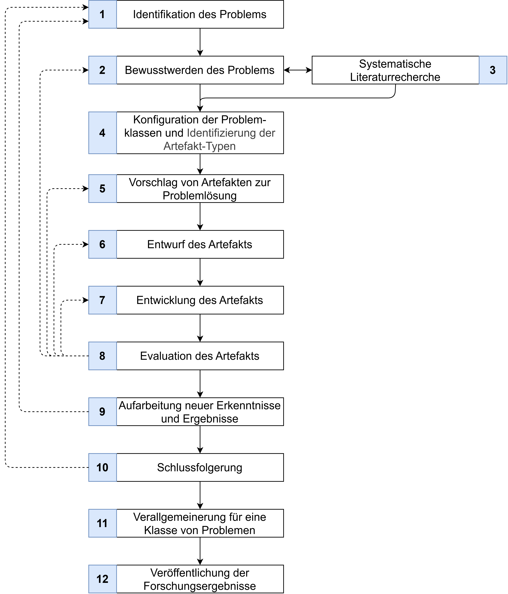

# Design Science Research as Research Methodology

This research work employs the Design Science Research (DSR) methodology according to Dresch et al. DSR methods generally focus on the systematic solution of a relevant problem and the development of a solving artifact. This approach systematically incorporates existing knowledge while simultaneously generating new knowledge. Dresch et al. describe a process model and corresponding quality criteria that must be examined during progress.

## DSR Methodology Framework

The DSR methodology according to Dresch et al. consists of twelve steps, as illustrated in the figure below. Solid lines represent the linear application path of the methodology, while dashed lines indicate iteration paths. Iterations are necessary when new insights during progress require previously completed steps to be repeated.

*Figure: Methodology for approaching a research project following DSR principles according to Dresch et al.*

## The Twelve Steps

### Phase 1: Problem Understanding (Steps 1-4)

#### Step 1: Problem Identification

- Results in the initial research hypothesis as an approach to solving the relevant problem

#### Step 2: Problem Awareness

- Describes the necessity of having completely captured and understood the problem
- Includes stakeholder involvement

#### Step 3: Systematic Literature Review

- Supports comprehensive problem understanding
- Iteratively performed with Step 2 until complete problem understanding and artifact requirements are established

#### Step 4: Problem Class Configuration and Artifact Type Identification

- Focuses on analyzing the state of knowledge
- Existing knowledge from literature is compared with the problem using defined characteristics
- Similar knowledge forms "problem classes" - collections of existing knowledge about possible solutions
- Identifies previously used artifact types for own research

### Phase 2: Artifact Development (Steps 5-8)

#### Step 5: Artifact Proposal for Problem Solution

- Begins actual development work in DSR
- Evaluates one or more artifact proposals created through creative processes
- Results in a formulated approach to problem solution and necessary artifacts

#### Step 6: Artifact Design

- Detailed elaboration and description of necessary artifacts
- Based on requirements and stakeholder expectations from Steps 2-3

#### Step 7: Artifact Development

- Must be developed for use in the problem-relevant application context
- Forms the basis for subsequent evaluation

#### Step 8: Artifact Evaluation

- Examines whether the artifact represents a satisfactory solution
- Tests both requirements/expectations and desired function for problem solution

### Phase 3: Knowledge Generation (Steps 9-12)

#### Step 9: Processing New Insights and Results

- Documents scientific and practical experiences
- Important for future work by self and others

#### Step 10: Conclusion

- Identifies positively influencing decisions and measures that led to successful artifact evaluation

#### Step 11: Generalization for a Problem Class

- Generalizes processed insights, results, and positive influence factors
- Formulates them for a class of problems

#### Step 12: Publication of Research Results

- Makes generalized content accessible to the professional community
- Expands existing knowledge for the corresponding problem class
- Targets both researchers and practitioners in producing companies

## Key Characteristics

The DSR methodology explicitly addresses the tension between theory and practice. The goal is not only problem-solving but also preparing content so that results and insights are applicable for both science and practice.

The twelve steps systematically process an identified problem and make the gained insights and results available to the professional community. The methodology ensures rigorous research while maintaining practical relevance.