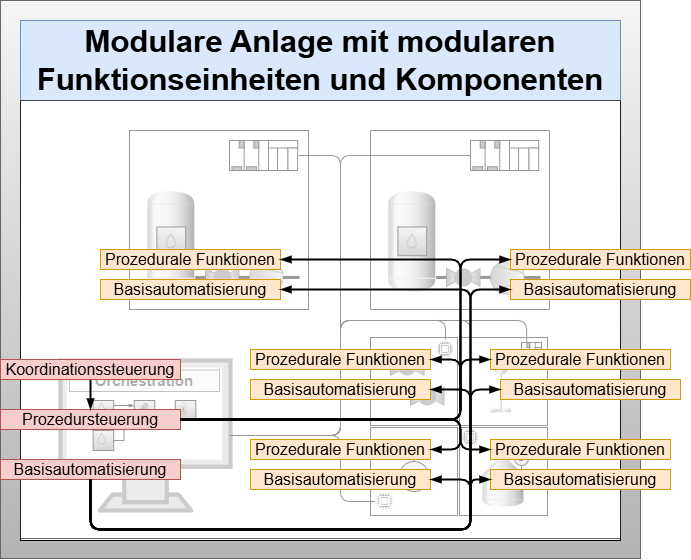
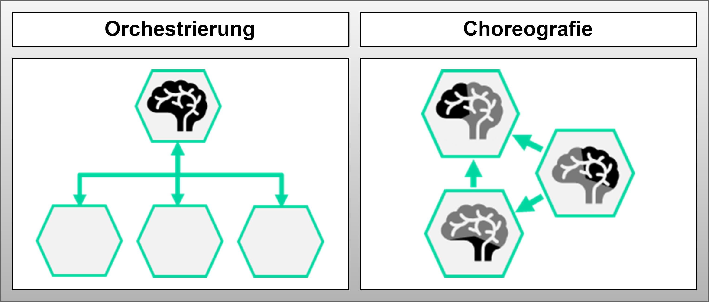

This page describes the research problem in its corresponding application context. The relevance of its solution considering entrepreneurial framework conditions and the limitations of current approaches are presented. A hypothesis is formulated that represents a possible problem solution. The chapter lays the foundation for the applied DSR process.

# Application Context

The work focuses on the process industry, which encompasses diverse sectors where intermediate and end products are manufactured through controlled material transformations. Product volumes range from millions of tons annually in petrochemicals to a few kilograms in specialty chemicals and pharmaceutical industry, with prices ranging from cent amounts to hundreds of thousands of euros per kilogram.

Plant types also vary greatly: from specialized continuous plants with few process steps in petrochemicals to complex multi-product multi-train plants with over 20 process steps in specialty chemicals and pharmaceutical industry. This broad spectrum illustrates the great heterogeneity of the process industry.

Therefore, this work concentrates on specialty chemicals and pharmaceutical industry. Products in the field of specialty chemicals and pharmaceutical industry are increasingly characterized by customer-specific properties, leading to growing product diversification and decreasing product volumes. Simultaneously, the complexity and volatility of global markets as well as competitive pressure are steadily increasing.

!!! success "Summary"

    The application context of this work is the automation of modular production systems in specialty and pharmaceutical industry for the systematic implementation of flexibility and adaptability.

# Current Approaches to implement Flexibility and Adaptability

For almost 20 years, the process industry has been using flexible production systems based on standardized models and automation mechanisms:

## ISA-88 Standard (IEC 61512-1, 1997)

- Introduced procedural abstraction based on state machines
- Defined automation functions at various granularity levels
- Enables flexible adaptation to processes through predefined operating modes and parameters
- Coordination control, procedure control, and basic automation work together
- Remains bound to monolithically built production structures

*Figure: Current approaches based on the automation concept for batch-based production (IEC 61512-1) (left) and the MTP concept (VDI 2658) (right) with their respective central components (red) and distributed components (yellow)*

## MTP Concept (VDI 2658, 2019 and VDI 2776-1, 2022)

The Module Type Package (MTP) concept focuses on:

- Fully implemented state machines representing encapsulated automation functions
- Enable cross-control connections of basic automation
- Process values are transmitted by the POL from one process value output of a PEA to a process value input of another PEA
- Granularity of automation functions follows the functional gradation from PEA to COMP
- The POL is responsible for bringing together automation services and creating executable overall automation

# Identification of the Research Problem

An increasing use of intelligent FEAs and COMPs within an MP while maintaining central orchestration in the POL leads to higher efforts in engineering and especially in the operation of the central orchestration of the POL.

*Figure: Future approach of central orchestration with increasing intelligent FEAs and COMPs*

## Problem Drivers

!!! warning "Increased Complexity"
   
    Significant increase in the number of procedural fine-grained functions
    Increase in necessary cross-functional continuous interconnections of basic automation

!!! warning "Virtualization Effects"
   
    Shift from process-near computing capacities to distant central data center capacities
    Longer latency times between POL and automation systems
    Restrictions on the use of highly flexible process functions and stable controls with small time constants

!!! warning "Engineering Challenges"
    
    Additional requirements regarding function sequences, exception handling, and continuous interconnection
    Higher communication and engineering efforts

## Research Problem

!!! danger "Statement" 

    The disproportionately high efforts in engineering and operation of the POL, due to the increased use of FEAs and COMPs, limit the flexibility and adaptability of modular production systems. The limitation of flexibility and adaptability in turn endangers the competitiveness of manufacturing companies, which is why this problem has both practical and economic relevance.

# Development of the Research Hypothesis

## Orchestration vs. Choreography

The central orchestration task of the POL lies in bringing together and coordinating automation services and process value interconnections with the goal of producing a product.

Modular production systems exhibit structures comparable to Microservice Architecture (MSA). In web technologies, orchestration and choreography are two methods for combining distributed service functions. According to literature, within an MSA, the choreography approach is preferable to orchestration when it comes to linking web services.

*Figure: Principles of orchestration and choreography in comparison (Hexagons: Services, Brain: Execution and scope of association rules, Arrows: Type of interaction pattern - unidirectional: Monitor-Act, bidirectional: Request-Reply)*

## Definitions

!!! success "Orchestration Definition"

    Orchestration is an association method that exists when (n+1) services are necessary to realize a composite service function. The additional (+1) service is the only one responsible for the execution of the subordinate (n) services.

- **Orchestration**: Central control with request-reply pattern, all orchestration rules in one service

!!! success "Choreography Definition"

    Choreography is an association method that exists when (n) services, based on the choreography rules of their own role, distribute the responsibility for realizing a composite service function among themselves.

- **Choreography**: Distributed control with monitor-act pattern, behavior rules distributed across all participating services

# Research Hypothesis

!!! success "Research Hypothesis"

    A choreography approach can reduce the efforts for bringing together fine-grained automation services and their process value interconnection in engineering and operation related to the central orchestration of the POL and thus expand the limits regarding flexibility and adaptability.

# Summary

The research addresses the fundamental challenge of increasing complexity in modular production systems as they become more distributed and intelligent. The hypothesis proposes that moving from centralized orchestration to distributed choreography could provide a solution to scalability and efficiency problems while maintaining or improving system flexibility and adaptability.  